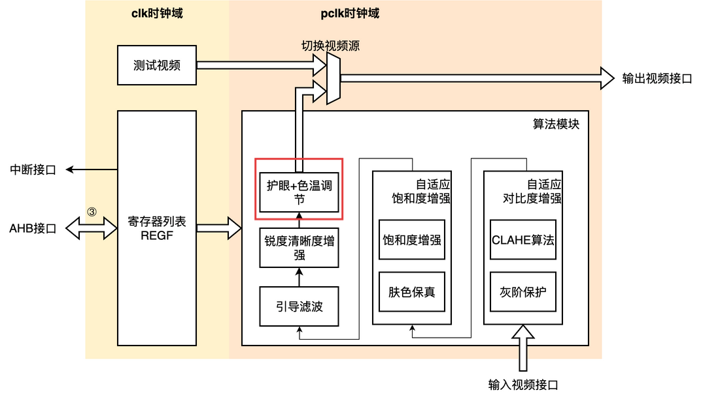
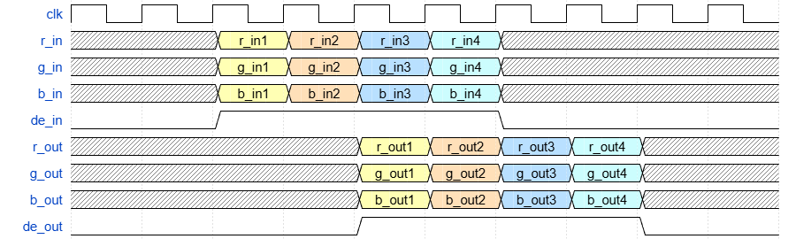
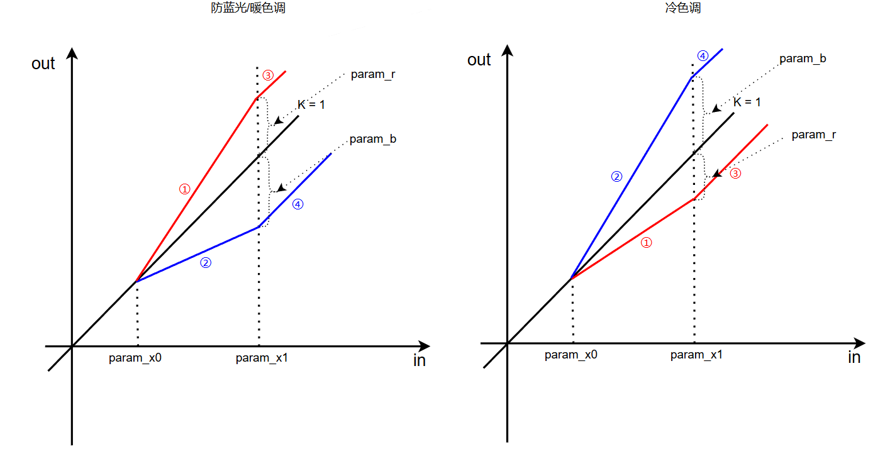
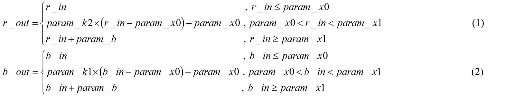
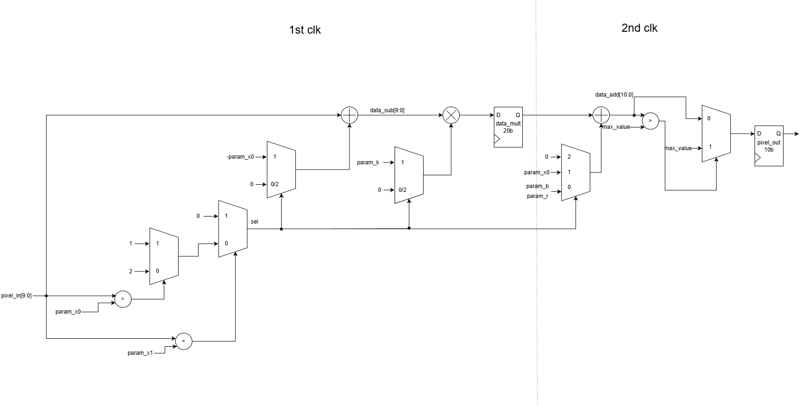

# ECA

## 0 修订历史

| 版本 | 释放日期 | 描述                               |
| :--- | -------- | ---------------------------------- |
| v1.0 | 20251129 | 1.护眼色温技术文档第一版           |
| v1.1 | 20251202 | 1.修改部分图片 2.完善部分表述 |

## 1 概述

### 1.1 模块功能

本模块通过动态调整输入视频RGB通道数据实现对蓝光的抑制/增强，以达到护眼和色温调节的功能。模块支持参数配置，在降低高能蓝光影响的同时保持画面色彩平衡。

### 1.2 模块定位

图1.1 护眼色温调节模块定位

- ECA模块全称Eyecare_cct_adjustment，意为护眼色温调节。
- 模块位于算法模块Algo\_top最末尾的位置。

### 1.3 模块特性

- **支持多种色深格式：** 算法模块兼容 **8比特** 和 **10比特** 两种视频色深输入。
- **支持多通道并行处理：** 可配置并行处理 **2、4、8** 个视频通道（LANE）的数据，适应不同吞吐率需求。
  - **动态时钟门控：** 为实现功耗最优化，当输入视频流的 LANE 数小于硬件支持的最大数量时，系统能够自动关闭未使用通道的时钟。
- **支持旁路直通模式：** 模块计算过程可**完全旁路**，实现视频数据的无损透传。
- **支持分屏对比功能：** 内置用于调试和效果演示的分屏对比功能，可实时、直观地评估算法效果。
  - **分屏规格：** 左半屏为算法处理后的数据，右半屏为原始直通数据。
- **支持参数在线配置：** 模块开放 **6个** 算法相关参数供在线配置，通过调节参数可灵活实现护眼模式或冷暖色调调节。
  - **阈值参数 (x~0~, x~1~)：** 将输入图像亮度范围划分为暗部、中间调和亮部三个区间。
  - **偏移量参数 (b，r)：** 用于直接调整调整 B、R亮部区域的强度。
  - **增益参数 (k~1~, k~2~)：** 分别用于调整 R、B 通道在中间调区域的对比度/增益。
- **时钟频率：** 模块运行时钟频率最高支持 **182MHz**（以4K\160hz\8lane规格 +10%计算）。
- **模块延迟：** 经过模块算法处理，数据输出延迟为 **2个** 像素时钟（注：具体以接口时序图为准）。

### 1.4 设计目标

1. **预期面积：** 16个`10比特x10比特`乘法器，`3000*8`与非门。
2. **预期时序：**支持最高频率**182MHz**，无时序违例。

## 2 接口定义

### 2.1 接口列表

| 名称       | IO   | 位宽 | 时钟域 | 连接     | 描述                                                         |
| ---------- | ---- | ---- | ------ | -------- | ------------------------------------------------------------ |
| clk1       | In   | 1    | pclk   | Algo_top | lane1-lane2像素时钟                                          |
| clk2       | In   | 1    | pclk   | Algo_top | lane3-lane4像素时钟                                          |
| clk3       | In   | 1    | pclk   | Algo_top | lane5-lane8像素时钟                                          |
| rst_n      | In   | 1    | pclk   | Algo_top | 复位，低有效                                                 |
| pixel_bits | In   | 1    | pclk   | Algo_top | 输入视频色深   0：8bit   1：10bit                  |
| lane_num   | In   | 2    | pclk   | Algo_top | 输入视频LANE数   0：2LANE   1：4LANE   2：8LANE |
| param_b    | In   | 10   | pclk   | Algo_top | B通道偏移量参数b                                             |
| param_r    | In   | 10   | pclk   | Algo_top | R通道偏移量参数r                                             |
| param_x0   | In   | 10   | pclk   | Algo_top | 左阈值坐标参数x0                                             |
| param_x1   | In   | 10   | pclk   | Algo_top | 右阈值坐标参数x1                                             |
| param_k1   | In   | 10   | pclk   | Algo_top | B分量对应增益参数k1  2bit整数+8bit小数                       |
| param_k2   | In   | 10   | pclk   | Algo_top | R分量对应增益参数k2  2bit整数+8bit小数                       |
| r_in       | In   | 80   | pclk   | Algo_top | R通路输入，8LANE*10bit                                       |
| g_in       | In   | 80   | pclk   | Algo_top | G通路输入，8LANE*10bit                                       |
| b_in       | In   | 80   | pclk   | Algo_top | B通路输入，8LANE*10bit                                       |
| de_in      | In   | 1    | pclk   | Algo_top | 像素输入有效信号                                             |
| r_out      | Out  | 80   | pclk   | Algo_top | R通路输出，8LANE*10bit                                       |
| g_out      | Out  | 80   | pclk   | Algo_top | G通路输出，8LANE*10bit                                       |
| b_out      | Out  | 80   | pclk   | Algo_top | B通路输出，8LANE*10bit                                       |
| de_out     | In   | 1    | pclk   | Algo_top | 像素输出有效信号                                             |

### 2.2 接口时序图

图2.1 护眼色温调节模块接口时序

>这个波形主要描述接口数据流，de\_in跟随像素输入r\_in，g\_in和b\_in指示有效性，经过**2个**像素时钟得到输出r\_out，g\_out以及b\_out，伴随de\_out指示有效性.

# 3 寄存器和存储器

### 3.1 寄存器映射表

#### 3.1.1 寄存器摘要

无

#### 3.1.2 寄存器描述

无

#### 3.2 存储器映射区间

无

## 4 详细设计

图4.1 护眼色温算法曲线

护眼色温算法曲线如图4.1所示。算法根据输入像素的亮度值，将其划分为三个区间进行差异化处理：

- **暗部区间 **$[0, param\_x0]$：保持像素原值不变，避免影响暗部细节。

- **中间调区间 **$(param\_x0, param\_x1)$：该区间是蓝光分量的主要分布区域。B通道执行曲线②计算，R通道执行曲线①计算。通过调节该区间的输出值，实现色温调节或蓝光抑制的核心效果。

- **亮部区间 **$[param\_x1, Max\_Value]$：B通道执行曲线③计算，R通道执行曲线④计算，确保亮度过渡平滑自然。

  >Max_Value为色深对应最大灰阶，色深为8比特时该值为255，色深为10比特时该值为1023。

### 4.1 ECA\_computation模块

#### 4.1.1 ECA\_computation模块功能描述

根据图4.1划分的三个区间进行计算，具体为下式(1)与式(2)：

#### 4.1.2 ECA\_computation模块详细设计

ECA\_computation模块电路结构如图4.2所示，主要包含**区间比较逻辑**、**算术运算单元**和**输出限幅**三个部分。

图4.2 ECA_computation电路图

1. **区间比较逻辑 (Range Comparator)**：
   - 输入像素 `pixel_in` 同时送入两个比较器，分别与阈值参数 `param_x0` 和 `param_x1` 进行比较。
   - 比较结果生成区间指示信号，用于判定当前像素属于暗部、中间调还是亮部区间。
2. **算术运算单元 (Arithmetic Unit)**：
   - **中间调计算**：根据公式 (1) 和 (2)，计算中间调区间的像素值。该路径通常包含减法器（`pixel_in - param_x0`）、乘法器（乘以增益 `param_k`）以及加法器（加上基准值），实现线性变换。
   - **亮部计算**：计算亮部区间的像素值，通常涉及减法或加法运算（如 `pixel_in - param_rb`），以实现亮度的整体偏移调整；此时乘法操作数被选择为0。
   - **暗部路径**：直接通过原始数据，“不进行算术运算”（此时乘法操作数被选择为0，加法操作数被选择为0）。
3. **输出限幅 (Output Clamping)**：
   - 为了防止数据溢出，运算结果在输出前会经过饱和截断处理 (Clamping)，确保输出值在有效位宽范围内（如 0\~1023）。
4. **流水线设计**：
   - 为了满足高频时序要求，模块内部设计了流水线寄存器（Pipeline Registers）。输入数据、中间计算结果和控制信号均经过打拍处理，确保关键路径的时序收敛。

## 5 时序要求

1. 关键路径：$param\_k\times\left( pixel\_in -param\_x0\right)$该乘法与加法须在1个像素时钟内完成；
2. 时序约束：clk1、clk2、clk3三个时钟为同源时钟；
3. 输入输出延迟约束：暂无
4. 多周期路径：无
