本文档为PQE（Picture Quality Engine）的硬件技术规格书，旨在详细阐述其设计、功能及接口标准。PQE是一个专用于实时视频流处理的硬件加速模块，其核心目标是通过一系列高级图像处理算法，显著提升最终画面的视觉质量。

PQE具备强大的视频格式兼容性，支持从1920x1080至3840x2160等多种分辨率，兼容60Hz~160Hz帧率及8/10-bit色深。其画质增强功能全面，集成了包括用于提升色彩鲜艳度的自适应饱和度增强、保护人像的“肤色保真”技术、采用CLAHE算法的自适应对比度增强以提升暗部细节、强化边缘的图像锐化，以及利用引导滤波防止天空等区域色阶断裂的保护机制。此外，还包含可调节色温的护眼功能。

该模块在架构上采用双时钟域设计，其中`clk`时钟域负责系统控制，`pclk`时钟域则同步于像素数据进行处理。数据流路径清晰，视频数据依次通过输入接口、核心的算法流水线模块，并最终由输出接口送出。系统的所有配置与控制均通过一个标准的AMBA AHB从接口实现，该接口允许外部控制器对核心寄存器文件（REGF）进行读写操作。这套寄存器系统提供了对各项算法参数的精细调节能力，并支持对视频的水平宽度与垂直高度进行独立配置，提供了高度的灵活性。

<font color=red>作为一份正在进行中的设计文档，部分章节如具体算法的硬件实现流程、性能与资源评估等尚在完善中。</font>

<div STYLE="page-break-after: always;"></div>

# 1 特性

1. **核心视频处理与接口**
   *   **灵活的视频流处理：**支持2、4、8个LANE的视频流输入，可灵活适配不同的视频源。<font color=red>（不支持16 LANE视频流输入）</font>
   *   **超高清：**全面兼容1K~4K（宽度介于1920~3840、高度介于1080~2160） ，例如1920x1080、2400x1200、2560x1440、2880x1620、3036x1708、3840x2160
   *   **高帧率：**兼容60Hz~160Hz帧率，例如 60Hz、120Hz 和 <font color=purple>160Hz</font> 帧率，<font color=red>不支持 160Hz 以上</font>
   *   **色彩深度：**支持 **8 比特、10 比特**色深。<font color=red>不支持12比特色深</font>
2. **支持视频整片处理 (Video Slicing):** PQE不支持将单帧画面分割为多个独立的“切片”(Slices)。这意味着如果视频源（如显示控制器）以切片方式提供视频流，必须由上游模块先将切片拼接成完整的一帧，再送入PQE
3. **不包含检测视频链路稳定性的逻辑。**当前的设计假设是：由外部控制器管理视频链路，确保其稳定后，再解除PQE的复位使其开始工作。不稳定的链路信号可能导致PQE输出视觉伪影或产生内部错误。


3. **高级图像增强算法**
   
   *   **自适应饱和度增强：** 
       *   **饱和度增强：**智能识别图像内容，采用**自然饱和度**，在提升色彩鲜艳度的同时，避免色彩失真。
            - [x]   可配置饱和度提升（连续）程度
       * **肤色保真：**通过人脸检测和肤色分区，保护人脸区域的色彩，使其在增强的同时保持自然。
       
         - [x] 可配置的检测模型： 肤色检测的模型参数存储于SRAM
       
          *   [x] 可开启或关闭肤色检测
       
   *   **细节增强**:
       *   **锐度-清晰度提升：**强化边缘细节，提升画面清晰度。
            - [x]   可开启或关闭降噪
            - [x]   可配置锐化（连续）程度
       
   *   **自适应对比度增强**:
       *   **CLAHE** 算法：显著提升图像暗部细节，让画面层次更丰富。
            - [x]   可开启或关闭HDR自动检测
            - [x]   可配置画面分块数量
            - [x]   可配置时间滤波因子
            - [x]   可配置HDR（连续）程度
       *   **灰阶保护：**内置场景检测机制，可识别纯色/渐变区域，并动态调节HDR等增强算法，以缓解（低）色阶梯度差异。
           - [x] 可配置灰阶范围、灰阶差异、纯色阈值 
       
   *   **图像保护与降噪**:
       *   **引导滤波**算法：自动识别天空等大面积纯色区域，防止图像增强导致的噪声放大。
            - [x]   可开启或关闭降噪
            - [x]   可配置降噪（连续）程度
       
   *   **舒适度提升：**
       *   **护眼色温调节：**降低蓝光，或者调节色温。提供蓝光模式和色温模式，减少长时间观看的视觉疲劳。
            - [x] 可配置色温模式、蓝光模式
            - [x] 可配置色温调节（连续）程度。可配置冷色调和暖色调
            - [x] 可配置蓝光调节（连续）程度
   
4. **调试功能：**
   *   **分屏对比功能：**可选左右分屏分别配置增强和关闭。可配置左右分屏效果对比，效果可配置为单一算法效果或者叠加算法效果
   *   **纯色图片输出：**支持输出纯色图片，用于调试
   
5.  **通讯与控制**

   *   **初始化：**通过AHB接口进行初始化，及在线参数配置
   *   **中断：** 通过 `intr` 信号向外部控制器报告关键事件。
   *   **视频输入输出**：
       *   **输入接口**：包含 `ide` (数据使能), `ihs` (行同步), `ivs` (场同步), `ick` (像素时钟), 和 `ida` (像素数据) 信号。
       *   **输出接口**：提供 `ode`, `ohs`, `ovs`, `ock`, 和 `oda` 信号，用于将处理后的视频流送至下游模块。

<div STYLE="page-break-after: always;"></div>

# 2 修订历史

| 版本     | 释放日期 | 描述                                                         |
| -------- | -------- | ------------------------------------------------------------ |
| **V1.0** | 20250910 | 1. 图像增强PQE第一次释放                                     |
| **V1.1** | 20250915 | 1. 第1章特性中，把帧率和分辨率分开<br />2. 第3.1小节中，修改切换视频源的描述<br />3. 修改3.2 小节，修改笔误<br />4. 寄存器摘要增加寄存器简写的全称 |
| **V1.2** | 20250916 | 1. 增加VID_CFG寄存器，用于配置分辨率、LANE、色深等信息<br />2. 增加文件摘要<br />3. 算法IP正式命名为PQE，并对文档相关字眼进行修改 |
| **V1.3** | 20250923 | 1. 增加 144Hz 帧率规格<br />2. 增加抗静电注入规格<font color=red>（待定）</font><br/>3. 回答第9章遗留问题1 |

<div STYLE="page-break-after: always;"></div>

# 3 数据流

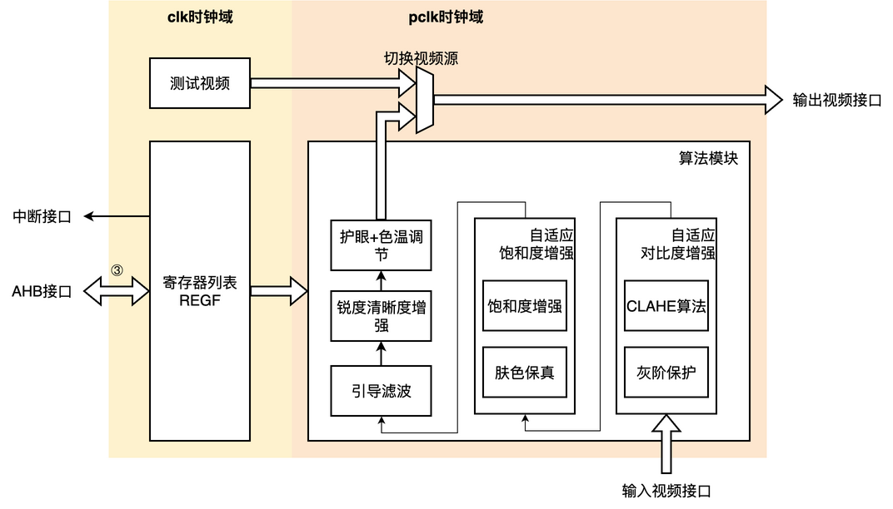

<small><b>图3.1 集成框架示意图</b></small>

这是一个基于**双时钟域**的视频处理系统架构，整个系统由左侧的 **`clk`时钟域**（浅黄色背景）和右侧的 **`pclk`时钟域**（浅橙色背景）组成：

## 3.1 `clk`时钟域（系统控制域）

该区域主要负责系统的控制、配置和视频源选择。

1. **测试视频 (Test Video)：** 用于生成测试信号的视频源模块。
2. **寄存器列表 (REGF)：** 一个大型的核心控制模块，通过标准 AHB 接口与外部控制器连接。
   - **中断接口 (INT Interface)：** 用于向系统控制器发送中断信号。
   - **AHB接口 (AHB Interface)：** 一个标准的AMBA总线接口，用于系统控制器对REGF模块内部的寄存器进行读写配置。
3. **切换视频源 (Video Source Switch)：** 一个关键的数据路径选择器，负责在“正常处理模式”和“调试模式”之间切换视频源。它横跨两个时钟域，但其控制逻辑应属于`clk`域。
   * **正常处理模式 (Normal Mode):** 在此模式下，模块选择来自 **算法模块 (Algorithm Module)** 的输出。这是系统默认的工作状态，所有经过图像增强算法处理后的视频数据将通过此路径输出。
   * **调试模式 (Debug Mode):** 当 REGF 寄存器中的 DEB_MODE 被激活时，系统进入调试模式。此时，该模块会选择来自 **测试视频 (Test Video)**模块的输出。测试视频模块可以生成固定的图像模式（如彩条、纯色或棋盘格），用于验证显示链路的完整性、时序和基本颜色表现，而无需依赖外部视频输入。

## 3.2 `pclk`时钟域（像素处理域）

该区域在`pclk`时钟驱动下，负责对视频流进行实时处理和输出，`pclk`的频率与视频的像素速率同步。

1. 输入视频接口 (Input Video Interface)

   作为外部真实视频流的入口，该接口接收来自上游视频源的原始像素数据。

2. 算法模块 (Algorithm Module)

   这是视频增强系统的核心处理单元。它是一个大型的流水线结构，接收来自“输入视频接口”的像素数据，并依次通过以下一系列串行处理的算法，完成画质增强：

*   **自适应饱和度增强**
    *   **饱和度增强:** 提升画面的色彩鲜艳度。
    *   **肤色保真:** 在增强饱和度的同时，保护人脸肤色，避免失真。
*   **自适应对比度增强**
    *   **CLAHE算法:** 增强图像暗部区域的细节。
    *   **灰阶保护:** 识别并保护大面积纯色区域，缓解对比度增强引入色阶断裂的问题。
*   **图像清晰度提升:** 增强图像的边缘和细节，使画面更清晰。
*   **引导滤波 :** 专门针对天空等大面积渐变区域进行保护，防止色阶断裂。
*   **护眼色温调节:** 调整色温，降低蓝光，提供更舒适的观看体验。

3. 输出视频接口 (Output Video Interface)

   处理完成的视频数据从此接口输出，送往显示设备或下一级处理单元。 

## 3.3 代码层级

该 IP 的代码层级结构如下：

*   **`pqe_top` (顶层模块)**
    这是整个 IP 的最顶层，负责例化和连接所有的子模块，并对外提供硬件接口（如 AHB、中断、视频输入/输出、时钟及复位信号）。

    *   **`regf` (寄存器列表模块)**
        *   **功能**: 作为 IP 的控制中心，提供 AHB 接口供软件配置参数、启动模块和读取状态。它负责将配置信号同步并分发给 `pclk` 域的各个算法模块。
        *   **所属时钟域**: `clk`
    *   **`tpg` (测试视频模块 / Test Pattern Generator)**
        *   **功能**: 用于生成内部测试视频码流，作为视频通路的输入源之一，便于调试和验证。
        *   **所属时钟域**: `clk`
    *   **`algorithm_module` (算法总模块)**
        *   **功能**: 这是视频处理的核心，它接收来自外部的视频输入，并包含了所有图像质量增强的算法子模块。
        *   **所属时钟域**: `pclk`
        *   该模块内部又包含以下并行的处理模块：
            *   **`ace` (自适应对比度增强模块)**
                *   `clahe` (CLAHE算法)
                *   `flat_region_protection` (灰阶保护)
            *   **`ase` (自适应饱和度与肤色保真模块)**
                *   `saturation_enhancement` (饱和度增强)
                *   `skintone_fidelity` (肤色保真)
            *   `guided_filter` (引导滤波)
            *   `sharpness_clarity_enhancement` (锐度清晰度增强)
            *   `eyecare_cct_adjustment` (护眼+色温调节)
    *   **`video_mux` (切换视频源模块)**
        *   **功能**: 这是一个输出选择器，它接收来自 `algorithm_module` 处理后的视频和来自 `tpg` 的测试视频（跨时钟域同步后），根据寄存器配置选择其中之一输出到 `输出视频接口`。这通常用于实现 bypass 功能或显示测试画面。
        *   **所属时钟域**: `pclk` 

<div STYLE="page-break-after: always;"></div>

# 4 接口列表

| 名称   | IO   | 位宽 | 时钟域 | 连接         | 描述               |
| ------ | ---- | ---- | ------ | ------------ | ------------------ |
| clk    | In   | 1    | -      | 系统时钟     | clk时钟            |
| rstn   | In   | 1    | clk    | -            | clk时钟复位        |
| pclk   | In   | 1    | -      | 像素时钟     | pclk时钟           |
| prstn  | In   | 1    | clk   | -            | pclk时钟复位       |
| haddr  | In   | 32  | clk   | AHB接口      | 地址总线           |
| htrans | In   | 2    | clk   | AHB接口      | 传输类型           |
| hsel   | In   | 1    | clk   | AHB接口      | 从设备选择          |
| hwrite | In   | 1    | clk   | AHB接口      | 传输方向           |
| hsize  | In   | 3    | clk   | AHB接口      | 传输大小           |
| hstrb | In | 4 | clk | AHB接口 | 字节选通 |
| hwdata | In   | 32   | clk   | AHB接口      | 写数据总线         |
| hrdata | out  | 32   | clk   | AHB接口      | 读数据总线         |
| hready | Out  | 1    | clk   | AHB接口      | 传输完成           |
| hresp  | In   | 2    | clk   | AHB接口      | 传输响应           |
| intr   | Out  | 1 | pclk   | 中断接口     | 发生中断。高有效 |
| ide    | In   | 1    | pclk   | 输入视频接口 | 输入像素使能       |
| ihs    | In   | 1    | pclk   | 输入视频接口 | 输入行同步         |
| ivs    | In   | 1    | pclk   | 输入视频接口 | 输入场同步         |
| ick    | In   | 1    | pclk   | 输入视频接口 | 输入像素时钟       |
| ida    | In   | 8x30 | pclk   | 输入视频接口 | 输入像素（8xLANE） |
| ode    | Out  | 1    | pclk   | 输出视频接口 | 输出像素使能       |
| ohs    | Out  | 1    | pclk   | 输出视频接口 | 输出行同步         |
| ovs    | Out  | 1    | pclk   | 输出视频接口 | 输出场同步         |
| ock    | Out  | 1    | pclk   | 输出视频接口 | 输出像素时钟       |
| oda    | Out  | 8x30 | pclk   | 输出视频接口 | 输出像素（8xLANE） |


## 4.1 AHB接口时序

### 4.1.1 AHB 简单传输

一个简单传输由两个阶段组成：地址阶段（Address phase）和数据阶段（Data phase）

* 地址阶段：持续一个时钟周期，除非它被前一个总线传输所扩展
* 数据阶段：可能持续几个时钟周期。使用HREADY信号控制等待传输的时钟周期数

HWRITE信号控制传输的方向：

* HWRITE 为高电平表示写传输。主设备通过 HWDATA 信号发送数据给从机
* HWRITE 为低电平表示读传输。从设备通过 HRDATA 信号发送数据给主机

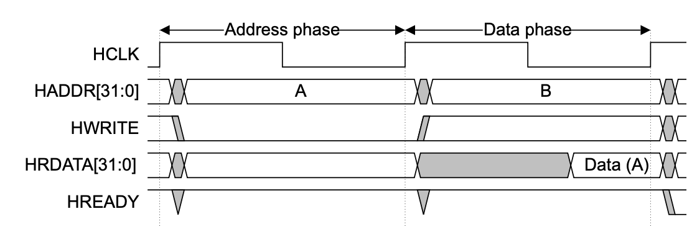

<small><b>图4.1 读简单传输</b></small>

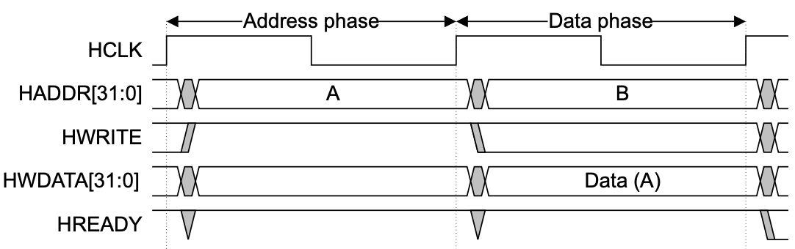

<small><b>图4.2 写简单传输</b></small>

在无等待状态的基本传输过程中：

1. 主设备（Manager）在HCLK上升沿后向总线发出地址和控制信号；
2. 从设备（Subordinate）在下一个HCLK上升沿对地址与控制信息进行采样；
3. 从设备完成采样后立即驱动相应的HREADYOUT响应信号，主设备将在第三个HCLK上升沿对该响应进行采样。

### 4.1.2 AHB等待状态传输

在写操作过程中，主设备会在整个扩展周期内保持数据稳定。对于读传输，从设备只需在传输即将完成时提供有效数据。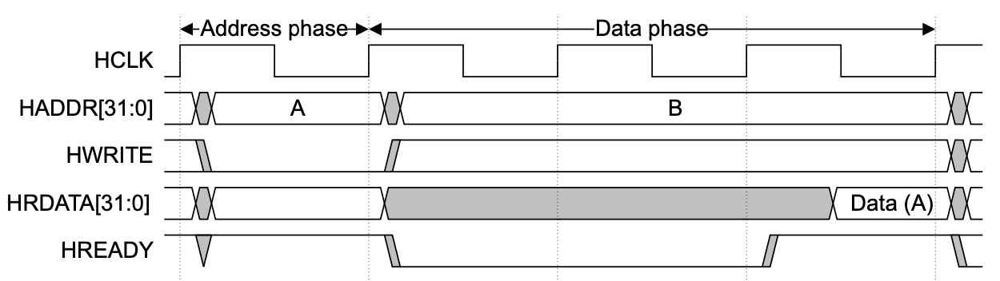

<small><b>图4.3 AHB读传输两个等待状态</b></small>

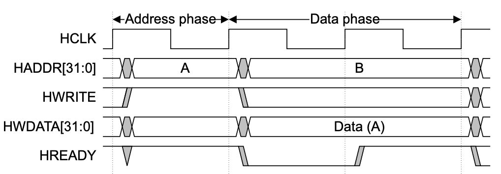

<small><b>图4.4 AHB写传输一个等待状态</b></small>

## 4.2 视频接口时序

LVDS/eDP/VBO 接口在进入 PQE 后，被相应的解码器解码成场同步信号 VS、行同步信号 HS、像素时钟 PCLK、数据有效信号 DE和视频数据 RGB。为了降低频率相关损耗、信号畸变和抖动和时钟恢复难度，视频在物理线中还会分成多个 LANE 来传输。多个 LANE 视频数据解码后，每个像素时钟周期输入多个视频像素。以RGB888、 1 个 LANE 每个像素时钟输入 1 个像素（24 比特）为例，视频时序图如下所示。

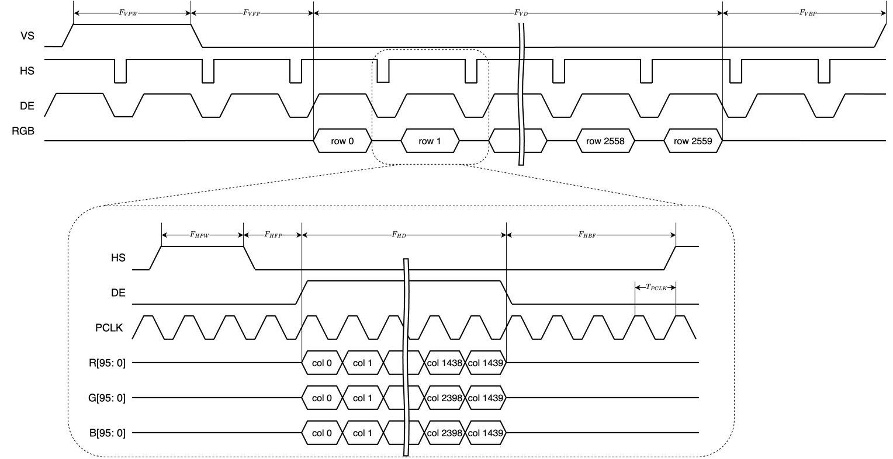

<small><b>图4.5 视频时序图</b></small>

- **VS场同步**：脉冲信号，标志新帧开始，扫描线复位到屏幕顶部。
- **HS行同步**：完成行切换（包含**H消隐区**）。脉冲信号，标记**一行像素的结束**和新行的开始
- **DE数据使能：**DE高电平，RGB数据有效，像素按PCLK节奏传输。DE低电平，RGB无效（消隐期），传输空白数据。
- **PCLK像素时钟**：基准时序源，每个上升沿触发一个像素数据的传输

<div STYLE="page-break-after: always;"></div>

# 5 功能描述

描述算法模块的算法原理和硬件流程。

## 5.1 自适应饱和度增强

自适应饱和度增强模块是PQE图像处理流水线中的关键一环，旨在智能提升画面色彩表现，同时避免常见的色彩失真问题。该模块包含两大核心功能：饱和度增强和肤色保真。前者负责提升整体画面的色彩鲜艳度，而后者则专注于识别人体肤色区域，确保在色彩增强过程中肤色保持自然、真实。二者协同工作，在增强视觉冲击力的同时，实现了对关键图像内容的精准保护。

### 5.1.1 饱和度增强

<big>**规格点**</big>

*   **兼容多色深:** 算法的内部数据路径和计算逻辑均支持 **8比特** 和 **10比特** 两种色深。
*   **支持多通道并行处理:** 可配置并行处理 **2、4 或 8 个**视频通道（LANE）的数据。
    *   **动态时钟门控:** 为实现功耗优化，当输入视频流的 LANE 数少于硬件支持的最大数量时，可以独立关闭（Gate）未使用处理通道的时钟。这一设计显著降低了模块在非全速运行时的动态功耗。
*   **支持真直通模式:** 模块支持将饱和度增强功能完全旁路，让原始视频数据无损通过。通过将饱和度调整量寄存器 $vibrance\_adjustment$ 配置为0，算法的增强效果被完全抑制，从而实现“真直通”。
*   **支持分屏对比功能:** 内置了用于调试和效果演示的分屏对比模式。在该模式下，屏幕左半边应用增强算法，右半变则保持原始画面。这为实时、直观地评估算法效果提供了极大的便利。
*   **采用自然饱和度算法:** 与相比线性饱和度算法，它能更智能地提升色彩。该算法会优先增强画面中较为暗淡的颜色，而对已经很鲜艳的颜色则处理得较为温和，有效避免了色彩溢出（Clipping）和过饱和问题。
    *   **可配置的增强（连续）程度:** 算法的增强强度（$vibrance\_adjustment$）可通过寄存器灵活配置，允许用户根据内容类型或个人偏好，对色彩增强的程度进行精细调节。
    *   **肤色保护集成:** 算法能够接收并应用来自“肤色保真”模块生成的肤色概率图（Skin Mask）。在进行饱和度增强时，它会降低或完全跳过对肤色区域的处理，确保人脸等部分的色彩在画面整体变得更鲜艳的同时，依然保持自然、真实。

<big>**算法原理**</big>

自然饱和度本质上是维持RGB最大通道的值不变，减少另外两个通道的值，从而拉大该像素点的极差，增大饱和度S。算法步骤如下：

1. 计算近似平均值$I_{avg}=(B_{i,j}+G_{i,j} \times 2 + R_{i,j})/4$
2. 找出最大值$I_{max}=max(B_{i,j},G_{i,j},R_{i,j}$)
3. 根据每个像素点对应调整因子$amt\_val=(I_{max}-I_{avg}) \times vibrance\_adjustment$，其中$vibrance\_adjustment=1-saturation$。这里的$vibrance\_adjustment$参数是可以通过寄存器配置的，用于控制饱和度增强的强度。$adjustment$ 用于控制饱和度增强等级的原始参数，取值大于等于1，值越大，饱和度增强效果越明显。
4. 调整每个颜色通道

$$
\begin{cases}
R'_{i,j}=R_{i,j}+(I_{max}-R_{i,j})\times amt\_val\\
G'_{i,j}=G_{i,j}+(I_{max}-G_{i,j})\times amt\_val\\
B'_{i,j}=B_{i,j}+(I_{max}-B_{i,j})\times amt\_val
\end{cases}
$$

5. 输出新像素$R'G'B'$

<big>**硬件实现**</big>

自然饱和度算法的硬件实现采用了为实时视频处理而优化的高度并行化流水线架构。下图展示了单个视频处理通道（LANE）的数据路径，该设计可被复制以支持2、4或8个并行LANE。整个处理流程与像素时钟（`pclk`）同步，确保了高吞吐量。

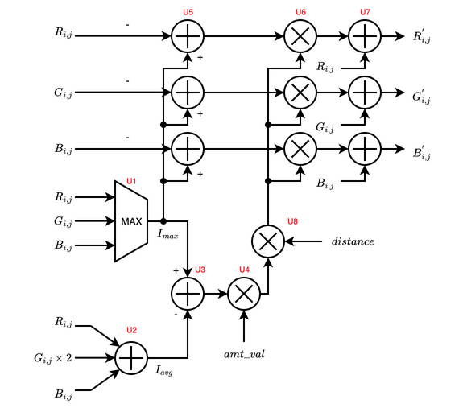

<small><b>图5.1 自然饱和度硬件实现示意图</b></small>

其核心处理流程分解为以下几个流水线阶段，每个阶段都与算法原理和下表中的硬件单元紧密对应：

1.  **像素分析阶段 ($I_{max}$ 与 $I_{avg}$ 计算):**
    *   流水线接收到10比特位宽的R、G、B输入像素后，立即并行计算两个关键分析指标。
    *   使用一个基于多路选择器的比较器逻辑（**U1**），在单周期内计算出三个颜色分量的最大值 $I_{max}$。
    *   同时，通过加法器（**U2**）和硬件移位操作（用于实现乘以2和除以4），高效计算出像素的加权平均值 $I_{avg} = (R + 2G + B) / 4$。此$I_{avg}$值作为像素强度的低成本近似。

2.  **调整因子计算阶段 (`amt_val`):**
    *   此阶段的核心任务是生成用于控制饱和度增强强度的调整因子 `amt_val`。
    *   首先，一个减法器（**U3**）计算出 $I_{max}$ 与 $I_{avg}$ 的差值。该差值直接反映了像素当前的饱和度水平：差值越大，饱和度越高。
    *   随后，该差值与一个来自寄存器、可由用户配置的全局参数 `vibrance_adjustment` 相乘（由乘法器 **U4** 实现）。`amt_val` 的值经过缩放，可确保对饱和度较低的像素施加更强的增强效果。

3.  **肤色保护集成阶段:**
    *   在应用前，`amt_val` 会经过一个关键的调制步骤，以集成肤色保护功能。
    *   一个调节因子 $P$（$P = 1 - S$，其中 $S$ 是来自“肤色保真”模块的肤色概率）被用于衰减 `amt_val`。这意味着，对于被识别为肤色的像素，饱和度增强效果将被减弱甚至完全抑制，从而保护肤色区域不产生失真。此调制过程由包括乘法器 **U8** 在内的逻辑处理，其中 `distance` 信号可能用于实现更精细的非线性调节。

4.  **最终颜色通道调整阶段:**
    *   流水线的最后阶段，经过肤色保护调制后的调整量将被并行地应用于R、G、B三个颜色通道。
    *   对于每个通道，首先由三个并行的减法器（**U5**）计算出 $I_{max}$ 与该通道值自身的差值（例如 $I_{max} - R$）。
    *   该差值随后被乘以经过调制的 `amt_val`。这一步由三个并行的 **U6** 乘法器完成，其位宽（10x21）足以保证计算精度。
    *   最后，乘法结果通过三个并行的加法器（**U7**）加回到原始通道值上（例如 $R' = R + (I_{max} - R) \times amt\_val \times P$），生成最终的增强后像素分量。
    *   增强后的 $R'G'B'$ 像素值随即输出到PQE流水线的下一个模块。

这种深度流水线与并行处理的设计，确保了在经过初始延迟后，每个时钟周期都能处理一个新像素，完全满足实时高清视频流的处理要求。

| 符号 | 描述                                       | 参数                         | 每LANE个数 | 总个数 |
| ---- | ------------------------------------------ | ---------------------------- | ---------- | ------ |
| U1   | 计算R,G,B三通道中的最大值 (I_max)            | 10比特                       | 1          | 8      |
| U2   | 用于计算加权平均值 (I_avg) 的加法器        | 10+10                        | 3          | 24     |
| U3   | 计算最大值与平均值的差值 (I_max - I_avg)     | 10-10                        | 1          | 8      |
| U4   | 计算初始调整因子 (amt_val)                   | 10x8                         | 1          | 8      |
| U5   | 计算各颜色通道与最大值的差值 (I_max - R/G/B) | 10-10                        | 3          | 24     |
| U6   | 将通道差值与调整因子相乘                     | 10x<font color=red>21</font> | 3          | 24     |
| U7   | 将调整结果加回原始颜色通道                   | 10+31                        | 3          | 24     |
| U8   | 根据肤色概率调制调整因子 (amt_val)           | 3x18                         | 1          | 8      |

* <font color=purple>amt_val的取值范围是8比特尾数，1比特符号</font>

* <font color=purple>distance的取值范围是3比特</font>


### 5.1.2 肤色保真

<big>**规格点**</big>

*   **色深处理:** 肤色检测算法的内部计算精度固定为8比特。对于8比特输入视频，直接使用其像素值；对于10比特输入视频，则截取像素值的高8位进行处理，低2位将被丢弃。
*   **支持多通道并行处理:** 可配置并行处理 **2、4 或 8 个**视频通道（LANE）的数据。
    *   **动态时钟门控:** 为实现功耗最优化，当输入视频流的 LANE 数少于硬件支持的最大数量时，系统能够独立关闭（Gate）未使用处理通道的时钟。这一设计显著降低了模块在非全速运行时的动态功耗。
*   **支持真直通模式:** 肤色检测功能可被完全旁路。在直通模式下，模块将向上游的饱和度增强模块输出一个恒定的“非肤色”信号（概率为0），确保后续处理模块不对像素进行任何基于肤色信息的调整，实现原始画质的无损通过。
*   **支持分屏对比功能:** 内置了用于调试和效果演示的分屏对比模式。在该模式下，屏幕左半边应用增强算法，右半变则保持原始画面。这为实时、直观地评估算法效果提供了极大的便利。
*   **采用肤色椭圆检测模型**
    *   **基于YCrCb颜色空间的肤色检测:** 采用高效、成熟的肤色检测模型，在 **YCrCb** 颜色空间中对像素进行分析。通过建立椭圆模型，精准识别出符合肤色特征的区域。
    *   **输出肤色概率图 (Skin Mask):** 算法的最终输出是一个与原始视频流同步的肤色概率图（Skin Mask）。肤色概率图中每个像素的值（0到1之间）代表其属于肤色的可能性。该图将被后续的图像增强模块（如饱和度增强）用作指导，以实现对肤色区域的精准保护，避免色彩增强时出现不自然的失真。
    *   **动态可配置的检测模型：** 肤色检测的椭圆模型参数存储于SRAM，支持通过寄存器更新椭圆参数。此设计旨在灵活适应不同光照条件与场景，从而提升检测精度。<font color=red>每次上电时都要配置，增加初始化时间，需要讨论。采用ROM则不需要配置过程。这需要跟芯格诺讨论确定</font>
    *   **资源共享设计:** 为优化资源利用，每2个并行处理的视频通道（LANE）将共享一套完整的肤色检测硬件模块（包括SRAM查找表）。


<big>**算法原理**</big>

肤色检测算法基于人的肤色在色度空间中呈现出聚类分布的特性。通过在 **YCrCb** 颜色空间的色度分量（**Cr 和 Cb**）上建立一个椭圆模型，可以有效地将像素划分为肤色和非肤色区域。该模型利用肤色在 Cr-Cb 色度平面上有限的分布范围（如 `133 ≤ Cr ≤ 173` 和 `77 ≤ Cb ≤ 127`），为每个像素计算一个肤色概率，从而实现精确的肤色识别与保护。

算法流程如下：

1. **建立肤色椭圆模型**：根据预设的肤色色度最大值和最小值（`crmax`、 `crmin`、 `cbmax`、`cbmin`），计算出椭圆的中心点 `(cr0, cb0)` 和长短半轴 `a` 和 `b`。这个椭圆在 **Cr-Cb** 色度平面上框定了典型的肤色区域。

2. **计算肤色相似度**：对于输入的每个像素，获取其 **Cr 和 Cb** 色度值（对应代码中的 `cr` 和 `cb`）。随后，根据椭圆方程 `((cr - cr0)² / a² + (cb - cb0)² / b²)` 计算该像素色度点到椭圆中心的归一化距离。

3. **生成肤色概率图**：将上一步计算出的距离值转换为肤色概率。转换公式为 `1 - 距离`。因此，色度值越接近椭圆中心，其肤色概率值越接近1；反之，越远离中心，概率值越低。

4. **阈值处理**：对于色度值在椭圆之外的像素，其概率值将被置为0，判定为非肤色。最终，算法输出一张肤色概率图（Skin Mask），图中每个像素的值$S$（0到1之间）代表其属于肤色的可能性。

5. **应用肤色保护**：生成的肤色概率图（Skin Mask）被传递给饱和度增强模块，用于调节增强强度，以保护肤色区域。一个像素的肤色概率越高，施加的饱和度增强效果就越弱。具体实现上，饱和度调整量会乘以一个调节因子 $P$。该调节因子 $P$ 与肤色概率 $S$（0到1之间）的关系为 $P = 1 - S$。因此，结合了肤色保护的饱和度增强公式更新为：
   $$
   \begin{cases}
   R'_{i,j}=R_{i,j}+(I_{max}-R_{i,j})\times amt\_val \times P\\
   G'_{i,j}=G_{i,j}+(I_{max}-G_{i,j})\times amt\_val \times P\\
   B'_{i,j}=B_{i,j}+(I_{max}-B_{i,j})\times amt\_val \times P
   \end{cases}
   $$


   *   当像素确定为肤色时（$S=1$），$P=0$，饱和度增强被完全抑制。
   *   当像素确定为非肤色时（$S=0$），$P=1$，饱和度增强效果不受影响。
   *   当像素肤色概率介于0到1之间，饱和度增强受到调节因子$P$的影响。调节因子越大，饱和度增强的效果越强


硬件实现上，为达到实时处理的性能要求，该算法采用了基于查找表（LUT）的优化方案。椭圆模型的计算被预先计算并存储在SRAM中。具体来说，公式`1 - k * ((cr - cr0)² / a² + (cb - cb0)² / b²)`被拆分为两个部分，分别生成两个查找表：

*   查找表1 (由`cr`寻址): `f(cr) = 1 - k * ((cr - cr0)² / a²)`
*   查找表2 (由`cb`寻址): `g(cb) = -k * ((cb - cb0)² / b²)`

这两个查找表被存入一个单端口SRAM中（每 2 个LANE需要一个 SRAM），使得可以根据像素的`cr`和`cb`值在一个时钟周期内并行读出`f(cr)`和`g(cb)`。最后，通过一个加法器将这两个值相加（`dist = f(cr) + g(cb)`），即可高效地计算出最终的肤色概率。这种方法将复杂的乘法和除法运算转换为了两次内存读取和一次加法，极大地节约了逻辑资源。

```python
def skin_detection(cr, cb, k=1.0, crmax=173, crmin=133, cbmax=127, cbmin=77):
    # reference: https://juejin.cn/post/7304638022961233955
    a = (crmax - crmin) / 2
    b = (cbmax - cbmin) / 2
    cr0 = (crmax + crmin) / 2
    cb0 = (cbmax + cbmin) / 2
    dist = 1 - k * ((cr - cr0) ** 2 / a ** 2 + (cb - cb0) ** 2 / b ** 2)
    dist[dist < 0] = 0
    return dist
```


> [!IMPORTANT]
>
> **YCrCb 颜色空间的局限性：光照影响**
>
> 尽管 YCrCb 颜色空间通过分离亮度（Y）和色度（Cr, Cb）简化了肤色检测，但它存在一个固有问题：**色度分量（Cr, Cb）并未完全与光照条件解耦**。当环境光照的强度或色温发生变化时（例如，从室内暖色灯光变为室外冷色日光），相同皮肤的 Cr 和 Cb 值会发生显著漂移。
>
> 这种漂移会导致预设的固定肤色椭圆模型失效，产生两类错误：
>
> * **漏检（False Negatives）**：在某些光照下，真实的肤色像素点可能会漂移到椭圆模型之外，导致检测失败。
> * **误检（False Positives）**：非肤色区域（如黄色或红色的物体）的像素点也可能因光照变化而漂移到椭圆模型之内，被错误地识别为肤色。
>
> 因此，基于固定阈值的 YCrCb 肤色检测算法在光照条件多变的场景下鲁棒性较差，这也是考虑使用其他颜色空间（如 YCoCg）或更复杂自适应算法的原因之一。

<big>**硬件实现**</big>

肤色保真算法的硬件实现采用了一种高效的、基于查找表（LUT）的架构，以满足实时视频处理的严苛性能要求。该设计将复杂的椭圆模型数学运算预先计算并存储在SRAM中，从而将像素处理过程简化为两次内存读取、一次加法和一次限幅操作，极大地节省了逻辑资源并降低了功耗。

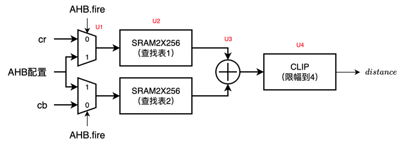

<small><b>图5.2 肤色保真硬件实现示意图</b></small>

如图5.2所示，其核心硬件逻辑包括输入选择复用器（**U1**）、两个256项的单端口SRAM（**U2**）、一个加法器（**U3**）和一个限幅模块（**U4**）。使用两个独立的单端口SRAM，是为了能够在一个时钟周期内并行地根据`cr`和`cb`值进行查找，从而满足实时处理的吞吐量要求。该架构支持两种主要工作模式：

1.  **正常处理模式 (Processing Mode):**
    *   在此模式下，`AHB.fire` 信号为低电平，输入复用器（**U1**）选择来自视频处理流水线的实时 `cr` 和 `cb` 色度分量。
    *   `cr` 和 `cb` 值（8比特精度）分别作为地址输入到两个单端口SRAM（**U2**）中。
    *   SRAM并行输出预先计算好的部分概率值 `f(cr)` 和 `g(cb)`。
    *   加法器（**U3**）将这两个值相加，得到肤色概率的中间值。
    *   最后，限幅模块（**U4**）将相加后的结果进行处理，确保其最大值不超过4。这个经过限幅的最终结果作为 `distance` 信号输出到饱和度增强模块。

2.  **配置模式 (Configuration Mode):**
    *   当需要更新肤色检测模型时，可通过AHB总线进入配置模式。
    *   此时，`AHB.fire` 信号为高电平，输入复用器（**U1**）选择来自 `AHB配置` 总线的信号。
    *   外部控制器可通过AHB接口，将新的查找表数据逐项写入到两个SRAM（**U2**）中。

根据规格，每2个视频处理通道（LANE）共享一套如图所示的肤色保真硬件模块。下表为每2个LANE的资源统计：

| 符号 | 描述                               | 参数    | 每2 LANE个数 | 总个数 |
| ---- | ---------------------------------- | ------- | ------------ | ------ |
| U1   | AHB与像素通道的输入选择器          | 8比特   | 2            | 8      |
| U2   | 存储肤色模型参数的单端口SRAM       | 256x8   | 2            | 8      |
| U3   | 加法器，用于累加cr/cb的查找表结果  | 8+8     | 1            | 4      |
| U4   | 限幅模块，用于限制distance信号范围 | 8比特   | 1            | 4      |


## 5.2 自适应对比度增强

自适应对比度增强模块旨在提升图像动态范围与暗部细节。它集成了两大核心功能：首先，**CLAHE算法**通过对图像进行分块并自适应地增强局部对比度，有效提亮暗部；其次，**灰阶保护**机制会识别天空等平滑区域，并抑制对比度增强，以防止产生色阶断裂等失真。二者协同工作，在增强画面层次感的同时保证了视觉自然度。

### 5.2.1 CLAHE算法

<big>**规格点**</big>

*   **兼容多色深:** 算法的内部数据路径和计算逻辑均支持 **8比特** 和 **10比特** 两种色深。
*   **支持多通道并行处理:** 可配置并行处理 **2、4 或 8 个**视频通道（LANE）的数据。
    *   **动态时钟门控:** 为实现功耗最优化，当输入视频流的 LANE 数少于硬件支持的最大数量时，系统能够独立关闭（Gate）未使用处理通道的时钟。这一设计显著降低了模块在非全速运行时的动态功耗。
*   **支持真直通模式:** CLAHE算法功能可被完全旁路。由于色彩空间转换（RGB->HSV->RGB）和双线性插值等步骤会引入微小的计算精度损失，所以模块内置了“真直通”路径。当真直通模式被激活时，输入的视频数据将绕过整个CLAHE处理流水线，仅经过必要的延时以与模块处理延时对齐，然后直接输出。
*   **支持分屏对比功能:** 内置了用于调试和效果演示的分屏对比模式。在该模式下，屏幕左半边应用增强算法，右半变则保持原始画面。这为实时、直观地评估算法效果提供了极大的便利。
*   **基于HSV色彩空间的亮度处理:** 算法在HSV颜色空间中对亮度（V）分量进行处理。这可以有效增强对比度，同时避免在色度（H, S）上引入不自然的色彩偏移。（<font color=red>TODO，需要确定是否有其他低位宽的颜色域</font>）
*   **可配置的网格化处理:** 支持将图像划分为多个矩形块（Tiles），并对每个块独立计算直方图。
    *   **分块尺寸灵活可调:** 分块数可在2到8之间灵活配置（只适配2x2, 2x4, 2x8, 4x2, 4x4, 4x8, 8x2, 8x4, 8x8），以适应不同场景和性能需求。
    *   **自适应分块尺寸以兼容任意分辨率：** 为确保算法能处理任何视频分辨率，即便是其尺寸无法被网格（Tile）数量整除的情况，硬件将自动调整分块的大小。系统会计算出基础分块尺寸，并将剩余的像素（余数）均匀地分配给一部分分块。例如，当宽度为1921像素，网格水平数量为8时，系统会生成7个宽度为240像素的分块和1个宽度为241像素的分块。插值逻辑会精确处理这种非均匀分块的边界，确保像素值的计算在整个画面上平滑过渡，无任何接缝或突变。 
*   **可配置的对比度限制 (Clipping Limit):** 为抑制噪声放大，每个块的直方图在计算累积分布函数（CDF）前会进行限幅。该限制的阈值可以通过寄存器进行配置。
*   **可配置时间滤波因子:** 内置时间滤波器，通过平滑连续帧之间的直方图变换，有效减少或消除画面闪烁（Flicker）现象。
*   **只统计第一个通道视频数据的CDF:** 在处理多LANE视频流时，为节省资源，仅使用第一个LANE的数据来计算全局的直方图统计信息。生成的变换函数（CDF）将应用于所有的LANE。
*   **压缩 CDF 灰阶：**为降低面积消耗，将 CDF 进行压缩。对于 8 比特数据，压缩为 256 值域。对于 10 比特数据，压缩为 256 值域（<font color=red>TODO，10比特 CDF 是否能够压缩到256灰阶需要FPGA论证</font>）。
*   **CDF 值域：**8比特输入图像支持8比特值域，10比特输入图像支持10比特值域

<big>**算法原理**</big>

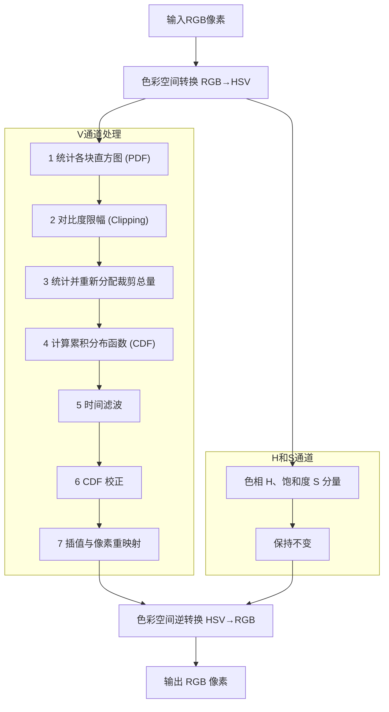

CLAHE（对比度受限的自适应直方图均衡）算法通过将图像划分为多个**非重叠**小区域（称为“Tiles”），并对每个区域独立进行直方图均衡化，从而实现对图像局部对比度的精细调整。其硬件实现流程如下：

1.  **色彩空间转换 (RGB→HSV)**：首先，输入像素从RGB色彩空间转换到HSV色彩空间。CLAHE仅对亮度分量（V-Channel）进行处理，以避免在增强对比度的同时引入色彩失真。
2.  **统计PDF**：将V分量平面划分为一个可配置的网格（例如8x8）。硬件会为每个独立的块（Tile）实时计算其亮度直方图（PDF, Probability Density Function）。为节省资源，该过程仅使用第一个LANE的视频数据来生成全局所有块的直方图。
    *  **对比度限幅 (Contrast Limiting)**：为防止噪声被过度放大，每个直方图灰阶的计数值（bin）会被限制在一个可配置的阈值（Clipping Limit）内。任何超过该阈值的计数值都会被裁剪。
    * **裁剪总量统计**：在进行限幅时，硬件会累加所有灰阶等级中被裁剪掉的像素总数。这个“裁剪总量”将在后续步骤中被平均重新分配到整个直方图中，以保持图像的整体亮度不变。
3.  **CDF计算 (Contrast Limiting & CDF Calculation)**：将上一步统计得到的“裁剪总量”平均分配到直方图的每一个灰阶等级中。然后，对这个经过修正和重新分配的直方图进行积分（累加），生成该块的累积分布函数（CDF）。
4.  **时间滤波 (Temporal Filtering)**：为消除连续视频帧之间因直方图突变而可能导致的画面闪烁（Flicker），计算出的CDF会经过一个时间滤波器。该滤波器通过对当前帧的CDF和前一帧的CDF进行加权平均，平滑了变换曲线的帧间过渡。
5.  **CDF校正 (CDF Correction)**：系统会并行分析图像内容，识别出大面积的纯色或暗部区域。根据分析结果生成一个掩膜（Mask），用于对相应图像块的CDF进行调整（校正），减弱在这些区域的对比度增强强度，从而保护这些区域不产生伪影。
6.  **插值与像素重映射 (Interpolation & Pixel Remapping)**：最后，对于图像中的每一个像素，其新的亮度值是通过一个多步插值过程计算得出的。首先，硬件会定位到该像素周围四个最邻近的图像块（Tiles）。然后，它会读取并解压缩相关联的CDF数据。具体而言，两个相邻的压缩CDF数据单元经过解码，得到插值前的CDF。由于存储的CDF是经过下采样（1024个灰阶等级）和压缩的，因此在用作映射前，需要先将其**上采样**恢复至完整的灰阶范围（256个等级）。最后，根据像素在当前块内的相对位置，对这四个上采样后的CDF的映射结果进行**双线性插值**，计算出最终的亮度值。这个过程确保了块与块之间的过渡平滑，有效避免了“块效应”（Blocking Artifacts）。
7.  **色彩空间逆转换 (HSV→RGB)**：经过增强的新亮度分量（V'）与原始的色相（H）和饱和度（S）分量重新组合，最后通过逆向色彩空间转换，得到最终输出的RGB像素。

> [!NOTE]
> 为节省硬件资源，在处理多LANE视频流时，仅使用第一个LANE的视频数据来计算所有图像块的直方图。生成的变换函数（CDF）将统一应用于所有的LANE。

<big>**硬件实现**</big>

CLAHE算法的硬件实现是一个为实时视频流优化的深度流水线架构。该架构围绕V通道（亮度）的处理构建，并在多个阶段中并行执行直方图计算、变换和像素重映射。为节约资源，所有直方图相关的计算（PDF统计、CDF生成等）仅使用第一个视频通道（LANE 0）的数据，但生成的变换函数（CDF）会应用于所有LANE的像素。

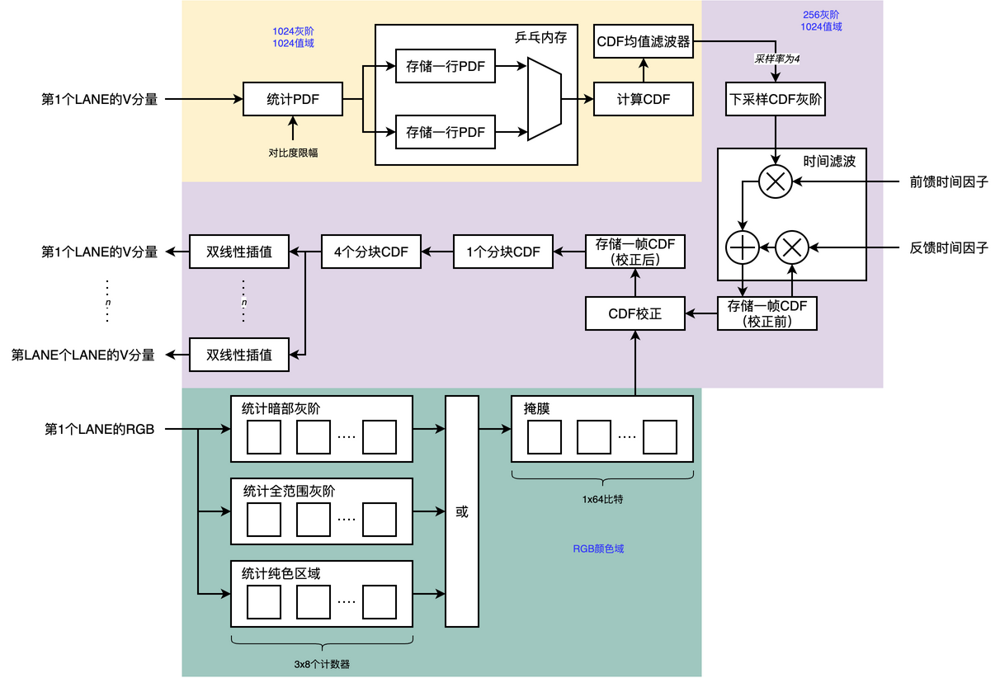  

<small><b>图5.3 CLAHE框架示意图</b></small>

其核心处理流程分解如下：

1.  **色彩空间转换与分块**：
    *   流水线首先将输入的RGB像素转换为HSV色彩空间。色相（H）和饱和度（S）分量被旁路并延迟，仅亮度（V）分量进入CLAHE核心处理流水线。
    *   V分量数据根据可配置的网格尺寸（如8x8）在逻辑上被分块。
2.  **直方图（PDF）统计与限幅**：
    *   **乒乓SRAM架构**：为实现高效的分块直方图计算，模块采用两块大小为 **9-bit x 8192** 的SRAM（对应资源表中的`存储一行PDF`）以**乒乓（Ping-Pong）模式**工作。当一个SRAM正在被写入当前处理行的像素直方图数据时，另一个SRAM中存储的上一行数据可被读出用于后续计算，实现了存储器访问的解耦和流水线效率的最大化。
    *   **对比度限幅**：在统计直方图时，每个灰阶等级的计数值（bin）都会经过一个限幅逻辑。任何超过预设阈值（Clipping Limit）的计数值都将被裁剪。由于SRAM位宽为9比特，<font color=purple>该限幅值必须小于511</font>。
    *   **裁剪总量累加**：硬件设有8个独立的计数器，用于实时累加所有灰阶等级中被裁剪掉的像素总数。这个“裁剪总量”将在后续步骤中被重新分配。
3.  **累积分布函数（CDF）计算**：
    *   **裁剪总量重新分配**：对于每个图像块，首先从计数器中读出其对应的“裁剪总量”，并将其平均分配到该块直方图的每一个灰阶等级中。
    *   **积分生成CDF**：随后，一个专用的累加器（对应资源表中的`计算CDF的累加器`）对修正后的直方图进行积分（逐级累加），生成初步的CDF。最后，通过一个除法器（`计算CDF的除法器`）将CDF归一化。
4.  **灰阶下采样（仅10比特模式）**：
    *   当处理10比特色深视频时，为降低后续CDF存储和处理的资源消耗，计算出的1024级灰阶CDF会经过一个**4倍最邻近下采样**，将其压缩至256级灰阶。8比特模式则跳过此步骤。
5.  **时间滤波**：
    *   为抑制视频帧间的闪烁，压缩后的CDF会通过一个**IIR时间滤波器**。该滤波器使用两个乘法器（`时间滤波的乘法器`）和一个加法器（`时间滤波的加法器`），将当前帧的CDF与存储在SRAM（`缓存一帧校正前CDF的SRAM`）中的前一帧CDF进行加权平均。这平滑了变换曲线的帧间过渡，增强了视觉稳定性。
6.  **CDF校正 (并行4路)**：
    *   时间滤波后的CDF会根据**灰阶保护**模块的输出进行校正，以减弱在平滑区域的对比度增强效果。为保证处理速度，此阶段采用4路并行处理。
    *   **性能考量**：CDF校正过程必须在帧间消隐期（Vertical Blanking Interval）内完成。对于一个8x8的网格，共有64个分块，每个分块的CDF有256个灰阶等级。硬件每个时钟周期并行读取4个CDF值进行校正并写回SRAM。因此，完成所有分块的校正共需要 $256 \times 64 / 4 = 4096$ 个时钟周期，<font color=purple>这个时间必须小于帧间消隐期的总时钟周期数</font>。
    *   校正后的最终CDF被写入一个大型SRAM（`存储一帧校正后CDF的SRAM`），准备用于下一阶段的像素重映射。
7.  **双线性插值与像素重映射**：
    此阶段负责根据计算出的CDF对每个像素的亮度值进行最终重映射，并通过双线性插值确保块间过渡平滑。为优化大规模SRAM的读取效率，该阶段采用了一个多级缓存策略。
    *   **CDF分块缓存与性能**：为了减少对存储整帧CDF的大型SRAM的频繁访问，硬件实现了一个两级寄存器缓存。
        *   **读取性能要求**：从SRAM中读取一个完整的CDF分块（256个值）必须非常迅速，其耗时需要小于处理一行像素中半个分块所需的时间。以4K@120Hz、8-LANE的典型场景为例，处理一行中半个分块的时间为 $3840 \text{ (宽度)} / 8 \text{ (LANE)} / 8 \text{ (水平分块数)} / 2 = 30$ 个时钟周期。
        *   **缓存实现**：为满足此要求，硬件采用16路并行度从SRAM读取数据，仅需 $256 / 16 = 16$ 个时钟周期即可读完一个分块，远小于30个周期的要求。读出的数据首先存入“1个CDF分块”寄存器组。当处理的像素跨越到需要新的CDF分块组合时，数据会被转移到“4个CDF分块”寄存器组中，该寄存器组在任何时候都保存着插值所需的最多四个邻近分块的CDF数据。
    *   **数据上采样与索引**：对于每个LANE的像素，插值单元需要同时从“4个CDF分块”缓存中索引8个CDF值（每个邻近CDF需要两个值进行线性插值）。在索引之前，经过压缩的CDF数据（如果来自10-bit流）需要先通过**上采样**逻辑恢复至完整的灰阶范围。
    *   **双线性插值计算**：一个专用的插值单元利用像素在当前块内的相对位置作为权重，对从缓存中读取并上采样后的四个CDF映射结果进行**双线性插值**。该单元包含多个乘法器（`双线性插值的乘法器`）和一个除法器（`双线性插值的除法器`），计算出该像素最终的、经过平滑过渡的新亮度值V'。
8.  **色彩空间逆转换**：
    *   最后，经过增强的新亮度分量V'与被精确延迟对齐的原始H和S分量重新组合，并通过逆向色彩空间转换模块，输出最终的RGB像素。

> [!NOTE]
>
> 8个双线性插值一共需要使用64个10比特的256选1选择器。后端PR时可能出现拥塞，可以把”四个分块CDF“的寄存器再复制一份

| 符号 | 描述                                  | 参数             | 每LANE个数 | 总个数 (8 LANE) |
| ---- | ------------------------------------- | ---------------- | ---------- | --------------- |
| -    | 存储一行PDF                           | 9X8192           | -          | 2               |
| -    | 计算CDF的累加器                       | 9+26             | -          | 1               |
| -    | 计算CDF的除法器                       | 26/16            | -          | 1               |
| -    | CDF均值滤波器的加法器                 | 10+10            | -          | 1               |
| -    | CDF均值滤波器的除法器（除以9）        | 14/4             | -          | 1               |
| -    | CDF均值滤波器的SRAM                   | 10x1024          | -          | 2               |
| -    | 时间滤波的乘法器                      | 10x8             | -          | 2               |
| -    | 时间滤波的加法器                      | 18+18            | -          | 1               |
| -    | 缓存一帧校正前CDF的SRAM               | 10X4096          | -          | 4               |
| -    | 存储一帧校正后CDF的SRAM（单端口SRAM） | 10X1024          | -          | 16              |
| -    | 一个分块CDF（寄存器）                 | 10X256           | -          | 2560            |
| -    | 四个分块CDF（寄存器）                 | 10X256X4         | -          | 10240           |
| -    | 双线性插值的乘法器                    | 11X11<br />22X11 | 1<br />3   | 8<br />24       |
| -    | 双线性插值的除法器                    | 29/15            | 1          | 8               |

### 5.2.2 灰阶保护

<big>**规格点**</big>

*   **兼容多色深:** 算法的内部数据路径和计算逻辑均支持 **8比特** 和 **10比特** 两种色深。对于8比特输入视频，直接使用其像素值；对于10比特输入视频，则截取像素值的高8位进行处理，低2位将被丢弃。
*   **支持分屏对比功能:** 内置了用于调试和效果演示的分屏对比模式。在该模式下，屏幕左半边应用增强算法，右半变则保持原始画面。这为实时、直观地评估算法效果提供了极大的便利。
*   **只统计第一个通道视频数据:** 在处理多LANE视频流时，为节省资源，仅使用第一个LANE的数据来计算。
*   **可配置的网格化处理:** 支持将图像划分为多个矩形块（Tiles），并可灵活配置每个块的尺寸。
*   **可配置的灰阶差异阈值:** 允许配置像素R、G、B分量之间的最大允许差异，以精确识别灰度区域。
*   **可配置的灰阶范围阈值:** 允许配置像素R、G、B分量的最大值，以识别暗部灰度区域。
*   可配置的纯色检测阈值：

<big>**算法原理**</big>

该保护机制旨在识别图像中对增强处理敏感的区域（如暗部、纯色、平滑渐变区域），以便其他算法（如CLAHE）可以动态调整其增强强度，避免在这些区域产生噪点或色阶断裂等失真。它主要通过“灰阶检测”和“分块纯色检测”两个并行算法实现。

1.  **灰阶检测 (Grayscale Detection Block by Block)**
    *   **目的**: 识别图像中的**暗部灰阶区域**。这些区域在对比度增强时，容易出现噪声被放大的问题。
    *   **原理**: 
        1.  **分块**: 将整幅图像划分为可灵活配置的矩形网格。
        2.  **像素级检测**: 在每个块内，对每一个像素进行判断。一个像素被识别为“灰阶像素”，需同时满足两个条件：
            *   **灰度条件**: 其R、G、B三个颜色分量两两之间的绝对差值均小于一个可配置的阈值 (`diff_thr`)。
            *   **亮度条件**: 其R、G、B三个分量的值都必须低于一个可配置的亮度阈值 (`grayscale_thr`)。
        3.  **块级统计**: 计算每个块内符合上述条件的像素所占的比例。这个比例值（`grayscale_ratio`）量化了该块的“暗部灰阶”程度。

2.  **分块纯色检测 (Solid Color Detection Block by Block)**
    *   **目的**: 识别图像中的**大面积纯色或平滑渐变区域**。这些区域在增强后容易出现色阶断裂（Banding）。
    *   **原理**: 
        1.  **分块**: 与灰阶检测类似，将图像划分为网格。
        2.  **像素级检测**: 在每个块内，通过两个并列的条件来判断一个像素是否属于“平坦”区域：
            *   **像素内均匀性 (Intra-pixel Uniformity)**: 判断当前像素的R, G, B值是否彼此接近（类似灰阶检测），用于识别灰阶区域。
            *   **像素间均匀性 (Inter-pixel Uniformity)**: 判断当前像素与前一个像素（按处理顺序）的R, G, B值是否分别都非常接近。这用于识别颜色基本不变的纯色区域或颜色变化极小的平滑渐变区域。
        3.  **块级统计**: 计算每个块内满足上述任一条件的像素所占的比例。这个比例值（`ratio`）量化了该块的“纯色/平坦”程度。

通过这两组从不同维度计算出的区域特征比例，系统可以生成一个保护图（Mask），用于指导前端的CLAHE等增强模块，在纯色、灰阶或暗部区域减弱其效果，从而达到保护画质的目的。


<big>**硬件实现**</big>

灰阶保护功能的硬件实现是一个高度并行的流水线架构，与CLAHE的分块处理紧密集成。它在处理第一个视频通道（LANE 0）的数据流的同时，实时为每个图像块（Tile）生成一个保护掩膜（Protection Mask）。

其核心处理流程如下：

1.  **像素级并行检测**：
    *   流水线接收到经色彩空间转换后的像素数据（通常为RGB或YCbCr的高8位）。
    *   **灰阶检测逻辑**：对于每个像素，一组并行的比较器和减法器会执行灰阶判断。这包括：
        *   三个减法器计算R, G, B分量两两之间的绝对差值。
        *   三个比较器将这些差值与可配置的`diff_thr`阈值进行比较。
        *   三个额外的比较器将R, G, B的值与`grayscale_thr`阈值进行比较。
        *   一个组合逻辑门（与门）将所有比较结果汇集，判断该像素是否为“暗部灰阶像素”。
    *   **纯色/平坦区域检测逻辑**：
        *   **像素内均匀性**：复用上述灰阶检测的部分逻辑来判断像素内部的颜色是否均匀。
        *   **像素间均匀性**：模块包含一个单像素寄存器，用于缓存前一个时钟周期的像素值。一组并行的减法器和比较器用于计算当前像素与前一像素各分量之差，并与阈值比较，以判断区域的平坦度。
        *   一个组合逻辑门（或门）将像素内和像素间的均匀性检测结果合并。

2.  **块级比例统计**：
    *   模块为每个图像块（Tile）维护两个独立的计数器：一个用于“暗部灰阶像素”，另一个用于“纯色/平坦像素”。
    *   当一个像素被对应的检测逻辑识别后，相应的块计数器会加一。
    *   在每个块的边界（由行、场同步信号和像素计数器共同判断），硬件会触发统计计算。

3.  **保护掩膜生成**：
    *   在块的末尾，每个计数器的值会被一个专用的除法器除以该块的总像素数，从而得到`grayscale_ratio`和`ratio`。
    *   这两个比例值随后被用于生成一个最终的保护掩膜值。该值量化了此区域需要被保护的程度。
    *   生成的保护掩膜被发送到CLAHE模块的“CDF校正”阶段，用于动态调整对比度增强的强度，从而保护图像质量。

## 5.3 锐化清晰度提升

<big>**规格点**</big>

*   **兼容多色深:** 算法的内部数据路径和计算逻辑均支持 **8比特** 和 **10比特** 两种色深。
*   **支持多通道并行处理:** 可配置并行处理 **2、4 或 8 个**视频通道（LANE）的数据。
    *   **动态时钟门控:** 为实现功耗最优化，当输入视频流的 LANE 数少于硬件支持的最大数量时，系统能够独立关闭（Gate）未使用处理通道的时钟。这一设计显著降低了模块在非全速运行时的动态功耗。
*   **支持真直通模式:** 锐化卷积过程可被完全旁路。在直通模式下，参数$a$被强制为1，参数$b$被强制为0，锐化效果被完全抑制，实现图像的无损通过。<font color=red>需要算法确认Padding不会影响真直通效果</font>
*   **支持分屏对比功能:** 内置了用于调试和效果演示的分屏对比模式。在该模式下，屏幕左半边应用增强算法，右半边则保持原始画面。这为实时、直观地评估算法效果提供了极大的便利。
*   **可配置的全局锐化算法：** 
    *   **基于YCoCg色彩空间的亮度锐化：** 算法首先将输入视频从RGB转换到YCoCg色彩空间，仅对亮度分量（Y）进行锐化处理。这种方法可以有效强化图像边缘和细节，同时避免在色彩边缘（色度分量 Co, Cg）产生常见的彩边或串色（Color Bleeding）现象。
    *   **可配置锐化强度：**核心锐化过程采用一个参数化的3x3卷积核。通过调整卷积核的中心权重（参数$a$）与相邻权重（参数$b$），可以灵活控制锐化的强度。


<big>**算法原理**</big>

锐化-清晰度提升算法的核心思想是通过增强图像中的高频信息（即边缘和细节）来提升画面的主观清晰度。该过程在硬件上通过一个高效的 **3x3 卷积**来实现，其原理等效于经典的**非锐化滤镜（Unsharp Masking）**。

算法流程被精心设计以在增强细节的同时，避免引入不必要的色彩失真：

1.  **色彩空间转换 (RGB → YCoCg):**首先，输入的RGB像素被转换到YCoCg色彩空间。YCoCg将亮度信息（Y）与两个色度信息（Co, Cg）分离开来。锐化操作将**仅在亮度（Y）分量上进行**，这可以有效避免在物体边缘产生彩虹或串色等现象，确保色彩的保真度。
    
2.  **亮度分量卷积锐化 (Y-Channel Sharpening):**亮度（Y）分量会通过一个参数化的3x3卷积核进行处理。该卷积核的形式如下：
    $$
    K = \left[
    \begin{matrix}
       0 & b & 0 \\
       b & a & b \\
       0 & b & 0
    \end{matrix}
    \right]
    $$
    这个卷积核通过计算中心像素与其上下左右四个邻近像素的加权和来生成新的亮度值。参数 $a$ 和 $b$ 的作用可以理解为：
    *   **参数 $a$**：中心像素的权重。
    *   **参数 $b$**：邻近像素的权重，通常为负值。
    
    该操作的本质是从中心像素中减去一部分其与周围像素的差异，从而“拉高”边缘的对比度。为了在锐化过程中保持画面的整体亮度不变，参数 $a$ 和 $b$ 需要满足约束条件：$a + 4b = 1$。通过调整参数（例如，增大 $a$ 并减小 $b$），可以控制锐化的强度。
    
3. **色彩空间逆转换 (YCoCg → RGB):**经过锐化处理的亮度分量 Y' 与未经修改的色度分量 Co, Cg 重新组合，并通过逆向色彩空间转换，得到最终增强后的RGB像素值。

锐度提升的Python代码如下：

```python
def sharpen(image):
    img_ycocg = bgr2ycocg(image)

	# sharpen
    kernel_lap = np.array([[0, -0.5, 0], [-0.5, 3, -0.5], [0, -0.5, 0]])
    img_lap = cv2.filter2D(img_ycocg[:, :, 0], -1, kernel_lap)
    img_ycocg[:, :, 0] = img_lap
    img_sharpen = ycocg2bgr(img_ycocg)
    return img_sharpen
```

<big>**硬件实现**</big>

锐化算法的硬件实现围绕一个高效的3x3卷积核展开，该卷积核专用于处理YCoCg颜色空间中的亮度（Y）通道，以在增强细节的同时避免色彩失真。整体架构采用流水线设计，确保了高吞吐量的实时处理能力。

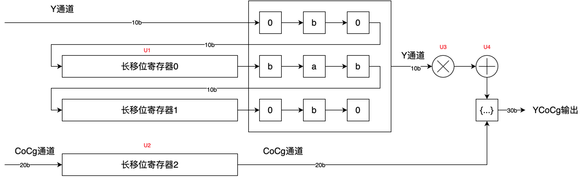

<small><b>图5.4 锐化硬件实现示意图</b></small>

如图5.3所示，该模块的核心数据路径可分为并行处理的**亮度（Y）通道**和**色度（CoCg）通道**。

1.  **Y通道处理流水线:**
    *   **行缓冲 (U1):** 为了构建3x3的像素处理窗口，输入的10比特Y通道数据首先进入一个由两个长移位寄存器（**U1**）组成的行缓冲模块。每个移位寄存器缓存一整行视频的像素数据。这样，在任何时刻，硬件都可以同时访问当前行、上一行和上上一行的像素，从而为3x3卷积提供必要的像素邻域。
    *   **3x3卷积核:** 硬件在3x3的像素窗口上实现了一个参数化的卷积。如图所示，这对应于算法原理中描述的卷积核 `K`。通过并行的乘法器和加法器（图中未单独标出符号），将中心像素与相邻像素乘以可配置的权重 `a` 和 `b` 并累加，生成一个高频分量。
    *   **强度调节与合并 (U3, U4):** 卷积产生的高频分量首先通过一个乘法器（**U3**）进行强度缩放，然后通过一个加法器（**U4**）与原始的中心像素（经过适当延时）相加。这个过程完成了非锐化滤镜（Unsharp Masking）的核心操作，将提取出的边缘细节叠加回原始图像上。

2.  **CoCg通道处理流水线:**
    *   **延迟匹配 (U2):** 由于Y通道的处理（行缓冲和卷积）引入了显著的流水线延迟，输入的20比特CoCg色度通道数据必须被同步延迟，以确保在最终输出时能与处理后的Y'通道数据正确对齐。这个延迟由一个长移位寄存器（**U2**）实现。

3.  **输出拼接:**
    *   最后，经过锐化处理的Y'通道（图中为10比特）与被精确延迟的CoCg通道数据重新拼接（Concatenate），形成最终的30比特YCoCg输出像素，然后传递给后续的YCoCg转RGB模块。

**SRAM复用机制**

为灵活支持2、4、8个LANE的视频流配置，行缓冲模块（U1和U2）采用了一套巧妙的资源复用机制。这些缓冲区的物理存储位宽是基于最大LANE数（8-LANE）设计的，并通过一个写控制逻辑来适配不同的输入位宽。以10比特色深的Y通道行缓冲（U1）为例，其物理位宽为80比特：

*   **8-LANE模式:** 每个时钟周期，8个LANE的80比特（8x10b）Y通道数据被一次性完整写入行缓冲。
*   **4-LANE模式:** 每个时钟周期，4个LANE的40比特（4x10b）数据被写入。写操作分两步进行：第一个时钟周期的数据写入行缓冲存储单元的低40比特；第二个时钟周期的数据则写入相同存储单元的高40比特。因此，需要两个时钟周期才能填满一个80比特的存储单元。
*   **2-LANE模式:** 与4-LANE模式类似，但需要四个时钟周期来填满一个80比特的存储单元。每个周期写入20比特（2x10b）数据，依次填充存储单元的0-19、20-39、40-59和60-79比特位。

CoCg通道的延迟缓冲（U2）也采用完全相同的机制来适配不同的LANE配置。这种设计在不同模式下复用了相同的物理存储和处理逻辑，有效地节约了芯片面积。

下表为该模块的资源统计：

| 符号 | 描述                            | 参数             | 每LANE个数 | 总个数 (8 LANE) |
| ---- | ------------------------------- | ---------------- | ---------- | --------------- |
| U1   | Y通道行缓冲 (Line Buffer)       | 80X480           | -          | 2               |
| U2   | CoCg通道延迟缓冲 (Delay Buffer) | 160X480          | -          | 1               |
| U3   | 锐化强度乘法器                  | 10x12<br />12x12 | 2          | 16              |
| U4   | 细节叠加加法器                  | 10+10<br />24+22 | 4          | 32              |

* <font color=purple>a、b为12比特参数，其中整数部分4比特，小数部分8比特</font>

## 5.4 引导滤波

<big>**规格点**</big>

*   **兼容多色深:** 算法的内部数据路径和计算逻辑均支持 **8比特** 和 **10比特** 两种色深。
*   **支持多通道并行处理:** 可配置并行处理 **2、4 或 8 个**视频通道（LANE）的数据。
    *   **动态时钟门控:** 为实现功耗最优化，当输入视频流的 LANE 数少于硬件支持的最大数量时，系统能够独立关闭（Gate）未使用处理通道的时钟。这一设计显著降低了模块在非全速运行时的动态功耗。
*   **支持真直通模式:** 锐化卷积过程可被完全旁路。在直通模式下，$a_k=1$，$b_k=0$
*   **支持分屏对比功能:** 内置了用于调试和效果演示的分屏对比模式。在该模式下，屏幕左半边应用增强算法，右半变则保持原始画面。这为实时、直观地评估算法效果提供了极大的便利。
*   **采用引导滤波算法：**将RGB颜色域转换为YCoCg颜色域，然后将输入的Y分量送入三个并行的处理路径：
    *   **主分支 (Main Branch)**：通过引导滤波器（Guide Filter）对图像进行基础的边缘保持平滑，去除大部分背景噪声。
    *   **提取高频分支 (High-Frequency Extraction Branch)**：通过高斯滤波器进行降噪，以增强图像清晰度。
        *   高斯滤波参数固定为$[1, 2, 1; 2, 4, 2; 1, 2, 1]$
        *   可配置阈值滤波阈值$threshold$
        *   可配置提取掩膜阈值$threshold_{hf}$、$threshold_{var}$
    *   **时间滤波分支 (Temporal Filtering Branch)**：结合中值滤波和时间滤波，处理视频帧之间的时间域噪声，有效抑制闪烁和噪点。
        *   均值下采样的尺寸固定为16x16
        *   均值滤波的尺寸固定为2x2
        *   支持双线性上采样，上采样尺寸固定为16x16<font color=red>（待定）</font>

<big>**算法原理**</big>

引导滤波算法的核心思想是利用一幅引导图像来指导另一幅输入图像的滤波过程。引导图像可以是输入图像本身，也可以是另一幅不同的图像。通过这种方式，引导滤波算法能够在局部区域内保持图像的边缘特征，同时平滑图像的细节部分。

引导滤波算法基于一个重要的假设：在局部窗口内，输出图像与引导图像之间存在局部线性关系。这意味着在每个局部窗口中，输出图像可以通过引导图像的线性变换来近似表示。具体来说，对于窗口中的每个像素点，输出图像的值可以表示为引导图像值的线性函数
$$
q_i=mean_{a_k}I_i+mean_{b_k}\tag{1}
$$
其中$q_i$是输出图像在位置$i$的像素值，$I_i$是引导图像在位置$i$的像素值，$a_k$和$b_k$是线性变换的系数，它们在每个局部窗口$\omega_k$中是常数。

求解系数$a_k$和$b_k$的过程涉及到最小二乘法和正则化，目标是在每个局部窗口$\omega_k$中最小化以下代价函数：
$$
E(a_k,b_k)=\sum_{i\in \omega_k}((a_kI_i+b_k-p_i)^2+\epsilon a_k^2)\tag{2}
$$
其中，$p_i$是输入图像在位置$i$的像素值，$\epsilon$是正则化参数，用于防止$a_k$过大，避免拟合。

求解系数$b_k$，首先对代价函数$E(a_k,b_k)$关于$a_k$和$b_k$求偏导并设为0，我们可以得到
$$
\begin{cases}
a_k=\frac{\frac{1}{|\omega|}\sum_{i\in\omega_k}I_ip_i-u_k\overline{p_k}}{\sigma_k^2+\epsilon}\\
b_k=\overline{p_k}-a_k\mu_k
\end{cases}\tag{3}
$$
其中$|\omega|$是窗口$\omega_k$内的像素数量，$\mu_k$是窗口$\omega_k$内引导图像$I$的均值，$\overline {Pi}$是窗口$\omega_k$内输入图像$P$的均值，$\sigma_k^2$是窗口$\omega _k$引导图像$I$的方差。最后，滤波后的输出图像$q$的像素值可以通过上述计算的大的系数$a_k$和$b_k$来确定。

由于引导滤波能够保持边缘信息不受影响情况下滤除噪音，因此在纯色背景区域及平坦区域既细节丰富区域及边缘区域中，系数$a_k$和$b_k$具有不同变化趋势，其滤波原理也有差异。

(1) 平坦区域中，引导图像$I$的方差$\sigma _k^2$，根据式(3)可知，$a_k$的值主要由$\epsilon $决定，系数值会偏小。而对于系数$b_k$而言，由于$a_k$偏小，则$b_k$的值会接近$overline{p_k}$。因此在平坦区域中，输出图像主要由窗口$\omega _k$中的像素均值决定，相当于进行了区域内的平滑滤波。

(2) 边缘区域中，引导图像$I$的方差$\sigma _k^2$较大，根据式(3)可知，$a_k$主要受$\frac{1}{|\omega|}\sum_{i\in\omega_k}I_ip_i-u_k\overline{p_k}$影响，在边缘两侧计算它的结果也会较大，因此$a_k$能够更好反映边缘的变化，同时$b_k$会变得更小。根据式(1)可知，输出图像的像素值$q_i$接近于引导图像的边缘信息。

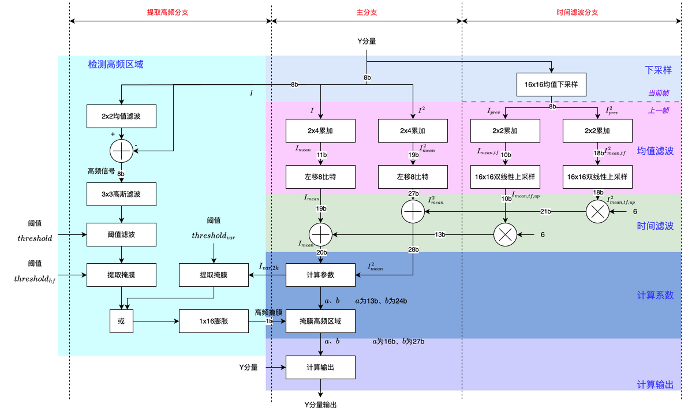

<small><b>图5.5 引导滤波算法框图</b></small>

根据框图，该算法的数据流可以分为三个主要部分：

1. 主分支是引导滤波的核心，负责计算滤波参数并生成最终输出。

- **输入**：接收8位的Y分量（亮度）数据，记为 `I`。
- **计算均值与平方均值**：
    1.  数据流分为两路，一路是原始数据 `I`，另一路是其平方 `I²`。
    2.  `I` 和 `I²` 分别经过 `2x4累加` 模块，得到初步的均值 `I_mean` (11b) 和平方均值 `I²_mean` (19b)。
    3.  这两个值再经过 `左移8比特` 操作，扩展位宽，分别得到19b的 `I_mean` 和27b的 `I²_mean`。
- **融合时间滤波结果**：
    1.  从 **时间滤波分支** 传入的时间滤波结果，与上述 `I_mean` 和 `I²_mean`进行融合（图中标为`+`运算，但通常是加权相减来抑制噪声），生成更稳定的 `I_mean` (20b) 和 `I²_mean` (28b)。
- **计算滤波系数**：
    1.  融合后的 `I_mean` 和 `I²_mean`，以及从 **提取高频分支** 传入的方差信息 `I_var,2k`，一同送入 `计算参数` 模块。
    2.  该模块计算出引导滤波的线性变换系数 `a` (13b) 和 `b` (24b)。
- **掩膜与输出**：
    1.  `a` 和 `b` 系数与 **提取高频分支** 生成的 `高频掩膜` (1b) 一同送入 `掩膜高频区域` 模块。此步骤的目的是在图像的平坦区域应用更强的滤波，而在高频（边缘和纹理）区域保留细节。处理后系数更新为 `a` (16b) 和 `b` (27b)。
    2.  最后，`计算输出` 模块利用更新后的 `a`、`b` 系数和原始的Y分量输入，计算出最终的滤波结果 `Y分量输出`。

2. 提取高频分支 (High-Frequency Extraction Branch)。该分支主要用于检测图像中的高频区域（如边缘、纹理），并生成一个掩膜（Mask）来指导主分支的滤波强度。

- **高频信号提取**：
    1.  输入的Y分量 `I` 首先经过一个 `2x2均值滤波`。
    2.  将原始 `I` 与均值滤波后的结果相减，得到 `高频信号` (8b)。
- **生成掩膜**：
    1.  高频信号经过 `3x3高斯滤波` 后，兵分两路。
    2.  两路分别使用不同的阈值 (`threshold` 和 `threshold_var`) 进行 `阈值滤波` 和 `提取掩膜`。其中一路还会输出方差 `I_var,2k` 供给主分支使用。
    3.  两路掩膜的结果经过一个 `或` 逻辑运算合并。
    4.  合并后的结果再经过 `1x16膨胀` 处理，生成最终的 `高频掩膜` (1b)。这个掩膜被送到主分支的 `掩膜高频区域` 模块。

3.  时间滤波分支 (Temporal Filtering Branch)。该分支利用前一帧的信息来增强当前帧滤波的稳定性，主要用于抑制时域上的噪声闪烁。

- **时序数据处理**：
    1.  Y分量首先经过 `16x16均值下采样`，以降低计算复杂度。
    2.  该模块同时处理 `当前帧` 和 `上一帧` 的数据，分别得到下采样后的 `I_prev` 和 `I²_prev`。
- **计算时域均值**：
    1.  这些时序数据经过 `2x2累加`（均值滤波），得到时间维度的均值 `I_mean,tf` (10b) 和平方均值 `I²_mean,tf` (18b)。
- **上采样与输出**：
    1.  `I_mean,tf` 和 `I²_mean,tf` 再通过 `16x16双线性上采样` 恢复到原始分辨率，得到 `I_mean,tf,up` 和 `I²_mean,tf,up`。
    2.  这两个值经过处理后（图中乘法器），作为时间校正量（13b和21b）被送往 **主分支**，用于调整当前帧的均值和方差计算，从而实现时间维度的滤波。

<big>**硬件实现**</big>

<font color=red>TODO</font>

## 5.5 护眼色温调节

<big>**规格点**</big>

*   **兼容多色深:** 算法的内部数据路径和计算逻辑均支持 **8比特** 和 **10比特** 两种色深。
*   **支持多通道并行处理:** 可配置并行处理 **2、4 或 8 个**视频通道（LANE）的数据。
    *   **动态时钟门控:** 为实现功耗最优化，当输入视频流的 LANE 数少于硬件支持的最大数量时，系统能够独立关闭（Gate）未使用处理通道的时钟。
*   **支持真直通模式:** 护眼色温的运算过程可被完全旁路，实现图像数据的无损通过。
*   **支持分屏对比功能:** 内置了用于调试和效果演示的分屏对比模式，可实时、直观地评估算法效果。在该模式下，屏幕左半边应用增强算法，右半变则保持原始画面。这为实时、直观地评估算法效果提供了极大的便利。
*   **支持护眼蓝光算法：**
    *   **可编程分段线性调整：** 算法核心为一个三段式的分段线性函数，其阈值点（$x_0$, $x_1$）和各段的调整参数（$Δb$, $k^*\times Δb$, $k$）均可通过寄存器配置，提供了高度的灵活性。
    *   **独立的通道处理：** 该分段调整函数可独立应用于R、G、B三个颜色通道，从而实现复杂的色彩调整。


<big>**算法原理**</big>

护眼与色温调节功能的核心是**对单个颜色通道进行分段线性变换**。该算法将输入像素的强度值划分为三个区域：暗部（shadows）、中间调（mid-tones）和亮部（highlights），并对不同区域施加不同的线性变换。这允许在调整整体色调的同时，保护暗部细节不被压缩，或防止亮部细节过曝。

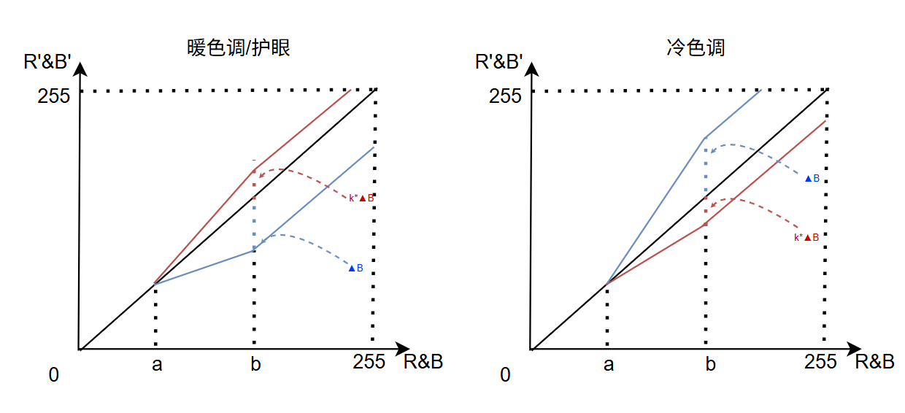

<small><b>图5.6 蓝光色温调整曲线示意图</b></small>

该变换由四个关键参数定义，这些参数均可通过寄存器进行配置：
*   `x0`, `x1`: 两个阈值，用于划分暗部、中间调和亮部。
*   `b`: 一个偏移量，用于直接增加或减少暗部或亮部的强度。
*   `k`: 一个斜率（增益），用于调整中间调的对比度。为确保分段函数的连续性，`k`的值由`x0`、`x1`和`b`共同决定。对于B通道其计算公式为：
$$
k = \frac{x_1 - x_0 + Δb}{x_1 - x_0}
$$

​	对于R通道计算公式为：
$$
k = \frac{x_1 - x_0 + k^* \times Δb}{x_1 - x_0}
$$

根据调整目标（增强或减弱通道），算法采用分段函数映射：

*   **暗部 (pixel <= x0):** 保持不变，防止暗部细节丢失。 (`output = pixel`)
*   **中间调 (x0 < pixel <= x1):** 强度根据斜率 `k` 进行线性映射，锚点为 `x0`。 (`output = (pixel - x0) * k + x0`)
*   **亮部 (pixel > x1):** 保持不变，防止过曝。 (`output = pixel`)

通过将这些变换独立应用于R、G、B通道，即可实现所需效果：
*   **护眼模式:** 对B通道应用$Δb < 0$，同时对R通道应用$Δb \times k^* > 0$。
*   **暖色温模式:** 对B通道应用$Δb < 0$，同时对R通道应用$Δb \times k^* > 0$。
*   **冷色温模式:** 对B通道应用$Δb > 0$，同时对R通道应用$Δb \times k^* < 0$。

```python
height, width = src.shape[:2]
for i in prange(height):
    for j in prange(width):
        val = src[i, j]
        if val >= thr_high:     # high region
            new_val = val + suppression
            if new_val < 0:
                new_val = 0
            elif new_val > max_range:
                new_val = max_range
            src[i, j] = int(new_val)

        elif val > thr_low:  # medium region
            new_val = (val - thr_low) * k + thr_low
            if new_val < 0:
                new_val = 0
            elif new_val > max_range:
                new_val = max_range
            src[i, j] = int(new_val)
        else: # low region
            pass
```

<big>**硬件实现**</big>

该算法的硬件实现为一个针对单个颜色通道的高度优化的流水线数据路径，如图所示。它通过执行分段线性变换来实时调整像素值。该数据路径的核心由一系列算术单元（U1, U3, U5）和多路选择器（U2, U4, U6）组成，它们根据输入像素值所属的区域（暗部、中间调、亮部）动态地改变计算流程。控制逻辑（图中未示）根据可配置的阈值 `x0` 和 `x1` 来判断像素所属区域。

其处理流程如下：

1.  **输入与加法（U1, U2）**:
    *   输入像素 `pixel` 首先进入加法器 **U1**。
    *   多路选择器 **U2** 根据像素区域选择一个偏移量。在中间调区域，它选择 `-x0` 以计算 `pixel - x0`；在其他区域，它选择 `0`，使像素值不变。

2.  **乘法（U3, U4）**:
    *   **U1** 的输出结果被送入乘法器 **U3**。
    *   多路选择器 **U4** 提供一个增益系数。在中间调区域，它选择斜率 `k`；在其他区域，它选择 `1`，以保持原始增益。
    *   **U3** 将偏移后的像素值与增益相乘。

3.  **最终偏移与输出（U5, U6）**:
    *   **U3** 的结果进入加法器 **U5**。
    *   多路选择器 **U6** 提供最终的偏移量。在中间调区域，它选择 `x0` 来完成 `(pixel - x0) * k + x0` 的计算；在其他区域，它可以选择 `0` 或其他可配置的值（如 `Δb` 或 `Δb * k*`）来对暗部或亮部进行微调。
    *   **U5** 将乘法结果与最终偏移量相加。

4.  **限幅（U7）**:
    *   最后，**U5** 的输出被送入 **CLIP（限幅）** 单元 **U7**。该单元确保最终输出值被限制在有效的颜色范围内（例如，对于8位色深，范围是0-255），防止因计算而导致的溢出或下溢。

整个流水线设计确保了每个时钟周期都能处理一个像素，满足了实时视频流的处理要求。

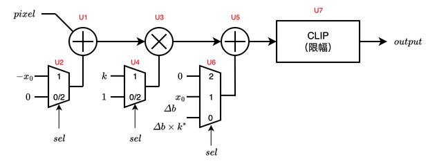

其中，$sel$信号表示为
$$
sel=
\begin{cases}
0, & pixel \ge x_1 \\
1, & x_1 \gt pexel \gt x_0\\
2, & x_0 > pixel
\end{cases}
\tag{3}
$$

<small><b>图5.7 护眼色温调节硬件实现示意图</b></small>

| 符号 | 描述       | 参数   | 每LANE个数 | 总个数 (8 LANE) |
| ---- | ---------- | ------ | ---------- | --------------- |
| U1   | 输入加法器 | 10+10  | 2          | 16              |
| U2   | 选择器     | 10比特 | 2          | 16              |
| U3   | 乘法器     | 10x10  | 2          | 16              |
| U4   | 选择器     | 10比特 | 2          | 16              |
| U5   | 输出加法器 | 20+11  | 2          | 16              |
| U6   | 选择器     | 11比特 | 2          | 16              |
| U7   | 输出限幅   | 21比特 | 2          | 16              |

* <font color=purple>$x_0$和$x_1$位宽为10比特</font>
* <font color=purple>$k$位宽为10比特</font>，<font color=red>TODO，确定k值的q值和取值范围</font>
* <font color=purple>$Δb$或者$Δb \times k^*$位宽为11比特有符号数</font>

<div STYLE="page-break-after: always;"></div>

## 5.6 颜色域转换

### 5.6.1 HSV颜色域

<font color=red>TODO</font>

### 5.6.2 YCoCg颜色域

<font color=red>TODO</font>

### 5.6.3 YCrCb颜色域

<font color=red>TODO</font>


<div STYLE="page-break-after: always;"></div>

# 6 寄存器列表

## 6.1 寄存器摘要

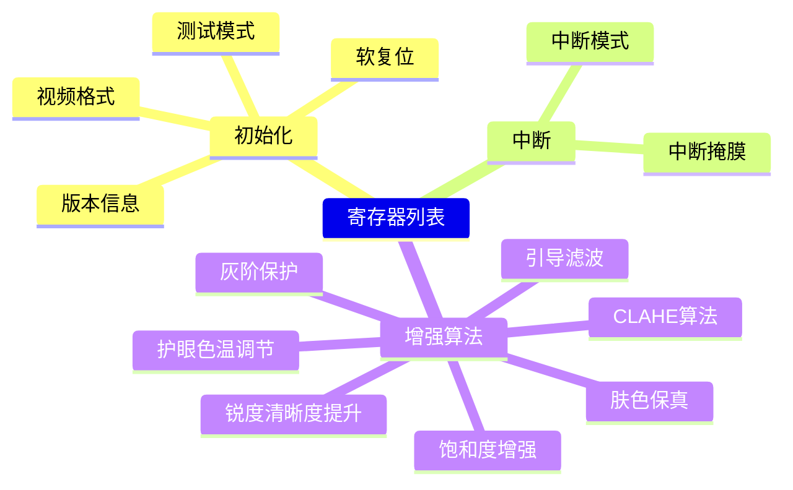

<small><b>图6.1 寄存器思维导图</b></small>

> [!IMPORTANT]
>
> 读取标记为**保留**的寄存器会得到相应的0反馈。写入标记为**保留**的寄存器不会改变0值。

<small><b>表 6.1 寄存器摘要</b></small>

| 名称     | 全称 | 地址      | 读写类型 | 默认值  | 描述                     | 章节                                          |
| -------- | --- | --------- | -------- | ------- | ------------------------ | --------------------------------------------- |
| FEAT_INFO  | Feature Information | 0x00      | RO       | -       | 描述PQE核的功能集与版本信息 | [6.2.1小节](###6.2.1-特性信息—FEAT_INFO) |
| SYS_CFG | System Configuration | 0x04      | RW       | 0x0 | 系统配置、中断配置 | [6.2.2小节](###6.2.2-系统配置—SYS_CFG)        |
| VID_CFG  | Video Configuration | 0x08      | RW       | 0x0 | 视频格式配置       | [6.2.3小节](###6.2.3-视频格式配置—VID_CFG) |
| HTIM_CFG | Horizontal Timing Configuration | 0x0C | RW | 0x0 | 水平消隐配置 | [6.2.4小节](###6.2.4-水平时序配置—HTIM_CFG) |
| VTIM_CFG | Vertical Timing Configuration | 0x10 | RW | 0x0 | 垂直消隐配置 | [6.2.5小节](###6.2.5-垂直时序配置—VTIM_CFG) |
| ALG_STS1 | Algorithm Status 1 | 0x14      | RO       | 0x0 | 算法状态寄存器 1         | [6.2.6小节](###6.2.6-状态寄存器1—ALG_STS1)       |
| ALG_STS2 | Algorithm Status 2 | 0x18      | RO       | 0x0 | 算法状态寄存器 2         | [6.2.7小节](###6.2.7-状态寄存器2—ALG_STS2)       |
| SHP_CFG  | Sharpening Configuration | 0x1C      | RW       | 0x0 | 图像锐化算法配置         | [6.2.8小节](###6.2.8-图像锐化算法配置—SHP_CFG)   |
| TMP_CFG  | Temperature Configuration | 0x20      | RW       | 0x0 | 护眼色温算法配置         | [6.2.9小节](###6.2.9-护眼色温算法配置—TMP_CFG)   |
| DET_CFG  | Detection Configuration | 0x24      | RW       | 0x0 | 肤色保真算法配置         | [6.2.10小节](###6.2.10-肤色保真算法配置—DET_CFG)   |
| SAT_CFG  | Saturation Configuration | 0x28      | RW       | 0x0 | 饱和度增强算法配置       | [6.2.11小节](###6.2.11-饱和度增强算法配置—SAT_CFG) |
| DEN_CFG  | Denoise Configuration | 0x2C      | RW       | 0x0 | 引导滤波算法配置       | [6.2.12小节](###6.2.12-引导滤波算法配置—DEN_CFG) |
| CONS_CFG | Contrast Configuration | 0x30      | RW       | 0x0 | CLAHE算法配置    | [6.2.13小节](###6.2.13-CLAHE算法配置—CONS_CFG) |
| PROT_CFG | Protection Configuration | 0x34      | RW       | 0x0 | 灰阶保护算法配置    | [6.2.14小节](###6.2.14-灰阶保护算法配置—PROT_CFG) |
| 保留     | - | 0x38~0xFF | RO       | 0x0 | 保留                     | -                                             |

> [!NOTE]
>
> RO: Read Only。表示该寄存器只能被读出。
>
> RW: Read and Write。表示该寄存器可读可写。
>
> W1C: Write 1 to Clear。表示向该寄存器写入1清零。

## 6.2 寄存器描述

### 6.2.1 特性信息—FEAT_INFO

**寄存器地址：0x00**

<small><b>表 6.2 FEAT_INFO</b></small>

| 位域名称  | 位域  | 复位值 | 描述                              |
| --------- | ----- | ------ | --------------------------------- |
| ALGORITHM | 6: 0  | -      | 增强算法组合<br/>0x33: 算法02     |
| 保留      | 7     | 0x0    | 保留                              |
| PART_NUM   | 31: 8 | -      | 核心板料号<br/>0x43: 14261000162B |

### 6.2.2 系统配置—SYS_CFG

ALG_CFG寄存器包含控制位和设置，使PQE适应特定的应用程序和系统要求。DEB_MODE连续写入$0x7 
\rightarrow 0xC 
\rightarrow 0xB$ 数字串进入debug模式。DEB_MODE没有按$0x7
 \rightarrow 0xC 
\rightarrow 0xB$ 顺序写入、或者中间读写其他寄存器地址，PQE不会进入debug模式。软件复位后退出debug模式。

**寄存器地址：0x04**

<small><b>表 6.3 ALG_CFG</b></small>

| 位域名称 | 位域   | 复位值 | 描述                                                         |
| -------- | ------ | ------ | ------------------------------------------------------------ |
| 保留     | 7: 0   | 0x0    | 保留                                                         |
| INT_EN   | 8      | 0x0    | 中断使能                                                     |
| 保留     | 11: 9  | 0x0    | 保留                                                         |
| DEB_MODE | 15: 12 | 0x0    | debug模式。连续写入$0x7 \rightarrow 0xC \rightarrow 0xB$ 数字串进入debug模式。<br/>在测试模式下，测试视频被使能。 |
| 保留     | 31: 16 | 0x0    | 保留                                                         |

### 6.2.3 视频格式配置—VID_CFG

**寄存器地址：0x08**

<small><b>表 6.4 VID_CFG</b></small>

| 位域名称 | 位域 | 复位值 | 描述 |
| :--- | :--- | :--- | :--- |
| VID_WIDTH | 12:0 | 0x0 | **视频宽度**<br/>配置视频流的水平分辨率（单位：像素）。 |
| VID_HEI | 24:13 | 0x0 | **视频高度**<br/>配置视频流的垂直分辨率（单位：像素）。 |
| FRAME_RATE | 27: 25 | 0x0 | **帧率选择**<br/>0: 60Hz<br/>1: 120Hz<br />2: 160Hz<br />3~7: 保留 |
| LANE_CNT | 29:28 | 0x0 | **LANE数选择**<br/>0: 2-LANE<br/>1: 4-LANE<br/>2: 8-LANE<br/>3: 保留 |
| COLOR_DEP | 31: 30 | 0x0 | **色深选择**<br/>0: 8-bit<br/>1: 10-bit<br />2、3: 保留 |

### 6.2.4 水平时序配置—HTIM_CFG
**寄存器地址：0x0C**
<small><b>表 6.5 HTIM_CFG</b></small>
| 位域名称 | 位域 | 复位值 | 描述 |
| :--- | :--- | :--- | :--- |
| HTOTAL | 12:0 | 0x0 | **行总长**<br/>配置视频流一行的总周期数（单位：pclk）。 |
| HSYNC_PULSE | 23:16 | 0x0 | **行同步脉冲宽度**<br/>配置行同步信号（HS）的脉冲宽度。 |
| H_BACK_PORCH | 31:24 | 0x0 | **行后肩**<br/>配置行同步信号结束到行有效数据开始之间的周期数。 |

### 6.2.5 垂直时序配置—VTIM_CFG
**寄存器地址：0x10**
<small><b>表 6.6 VTIM_CFG</b></small>
| 位域名称 | 位域 | 复位值 | 描述 |
| :--- | :--- | :--- | :--- |
| VTOTAL | 11:0 | 0x0 | **场总长**<br/>配置视频流一场的总行数。 |
| VSYNC_PULSE | 23:16 | 0x0 | **场同步脉冲宽度**<br/>配置场同步信号（VS）的脉冲宽度。 |
| V_BACK_PORCH | 31:24 | 0x0 | **场后肩**<br/>配置场同步信号结束到场有效数据开始之间的行数。 |

### 6.2.6 状态寄存器1—ALG_STS1

<font color=red>TODO</font>

**寄存器地址：0x14**

<small><b>表 6.7 ALG_STS1</b></small>

| 位域名称 | 位域  | 复位值 | 描述 |
| -------- | ----- | ------ | ---- |
| 保留     | 31: 0 | 0x0    | 保留 |

### 6.2.7 状态寄存器2—ALG_STS2

<font color=red>TODO</font>

**寄存器地址：0x18**

<small><b>表 6.8 ALG_STS2</b></small>

| 位域名称 | 位域  | 复位值 | 描述 |
| -------- | ----- | ------ | ---- |
| 保留     | 31: 8 | 0x0    | 保留 |

### 6.2.8 锐化清晰度提升算法配置—SHP_CFG

<font color=red>TODO</font>

**寄存器地址：0x1C**

<small><b>表 6.9 SHP_CFG</b></small>

| 位域名称 | 位域  | 复位值 | 描述 |
| -------- | ----- | ------ | ---- |
| 保留     | 31: 0 | 0x0    | 保留 |

### 6.2.9 护眼色温调节算法配置—TMP_CFG

<font color=red>TODO</font>

**寄存器地址：0x20**

<small><b>表 6.10 TMP_CFG</b></small>

| 位域名称 | 位域 | 复位值 | 描述 |
| -------- | ---- | ------ | ---- |
| 保留     | 31:0  | 0x0    | 保留 |

### 6.2.10 肤色保真算法配置—DET_CFG

<font color=red>TODO</font>

**寄存器地址：0x24**

<small><b>表 6.11 DET_CFG</b></small>

| 位域名称 | 位域  | 复位值 | 描述 |
| -------- | ----- | ------ | ---- |
| 保留     | 31: 0 | 0x0    | 保留 |

### 6.2.11 饱和度增强算法配置—SAT_CFG

<font color=red>TODO</font>

**寄存器地址：0x28**

<small><b>表 6.12 SAT_CFG</b></small>

| 位域名称 | 位域  | 复位值 | 描述 |
| -------- | ----- | ------ | ---- |
| 保留     | 31: 0 | 0x0    | 保留 |

### 6.2.12 引导滤波算法配置—DEN_CFG

<font color=red>TODO</font>

**寄存器地址：0x2C**

<small><b>表 6.13 DEN_CFG</b></small>

| 位域名称 | 位域  | 复位值 | 描述 |
| -------- | ----- | ------ | ---- |
| 保留     | 31: 0 | 0x0    | 保留 |

### 6.2.13 CLAHE算法配置—CONS_CFG

<font color=red>TODO</font>

**寄存器地址：0x30**

<small><b>表 6.14 CONS_CFG</b></small>

| 位域名称 | 位域  | 复位值 | 描述 |
| -------- | ----- | ------ | ---- |
| 保留     | 31: 0 | 0x0    | 保留 |

### 6.2.14 灰阶保护算法配置—PROT_CFG

<font color=red>TODO</font>

**寄存器地址：0x34**

<small><b>表 6.15 PROT_CFG</b></small>

| 位域名称 | 位域  | 复位值 | 描述 |
| -------- | ----- | ------ | ---- |
| 保留     | 31: 0 | 0x0    | 保留 |


<div STYLE="page-break-after: always;"></div>

# 7 性能与资源评估

<font color=red>TODO</font>

* **时钟频率**：给出 clk 和 pclk 的目标工作频率或最高频率。

* **处理延迟 (Latency)**：说明从像素数据输入到对应数据输出需要多少个 pclk 周期。

* **资源消耗**：提供在特定工艺节点上的预估资源使用情况。

<div STYLE="page-break-after: always;"></div>

# 8 集成与验证指南

<font color=red>TODO</font>

  * **时钟与复位**：简要说明双时钟域的设计策略、跨时钟域（CDC）的处理方式，以及推荐的复位时序。
  * **验证策略**：可以简要描述PQE的验证环境（如UVM、自校验测试平台等）和关键的测试场景，以增强用户对IP质量的信心。

<div STYLE="page-break-after: always;"></div>

# 9 遗留问题

1. <big><b>需要确认 HSV 的浮点位宽和定点位宽<font color=purple>（已解决，20250921）</font></b></big>

图 9.1 和 图9.2 进行了全面的实验。图 9.1 同时变化指数长度 (`exp_length`从1到8) 和尾数长度 (`mantissa_length`)**，揭示了这两个参数对 HSV 的量化误差 MSE 的影响。图 9.2 变化**尾数长度 (`mantissa_length`)，观察尾数长度对 HSV 的量化误差 MSE 的影响

- **浮点趋势解读**：**指数长度的“门槛”效应**
   - `exp_length = 1 ~ 2`：无论尾数长度如何增加（从0到20），MSE始终很高（约`1e-2`）。这说明**动态范围严重不足**。指数部分只有1-2位，根本无法覆盖HSV转换过程中可能产生的全部数值范围，导致大量数值被截断或溢出，此时尾数再精细也无济于事。
   - `exp_length = 3`：情况稍好，但误差依然较高，说明3位指数提供的动态范围仍然不够
   - `exp_length = 4 ~ 6`开始，我们才看到增加尾数长度能带来MSE的显著下降。指数长度越长（尤其是`exp_length=8`），MSE随尾数增加而下降的曲线越陡峭，最终能达到的精度也越高。
   - `exp_length = 7 ~ 8`的曲线表明在一个“指数长度充足”下，MSE能随尾数增加迅速下降。在尾数长度达到约**20位**之后，MSE下降到一个极低的水平（`1e-12`乃至更低）并趋于稳定，达到了“收益递减”的临界点。


   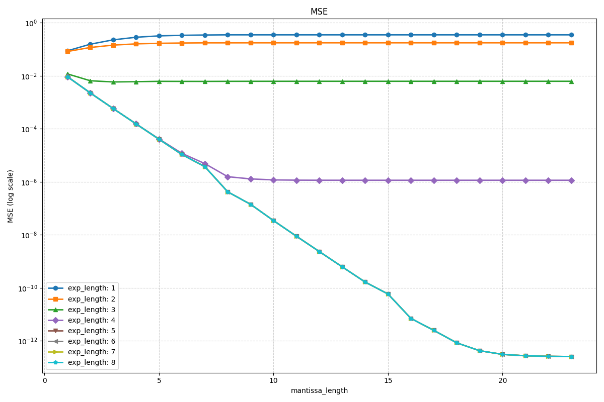

   <small><b>图9.1 HSV颜色空间在浮点表示下的结果</b></small>

   - **定点趋势解读**：
     - **单调递减与收敛**：MSE随着尾数长度的增加而呈数量级式下降（在对数坐标上呈直线下降趋势）。这表明更多的尾数位数能极大地提高颜色分量值的表示精度，从而减少转换误差。
     - **收益递减与饱和点**：在尾数长度达到约**20位**之后，MSE下降到一个极低的水平（`1e-12`乃至更低）并趋于稳定。这意味着在此情况下，20位尾数已经提供了接近浮点参考计算的精度，再增加尾数位数带来的精度提升微乎其微，达到了“收益递减”的临界点。

   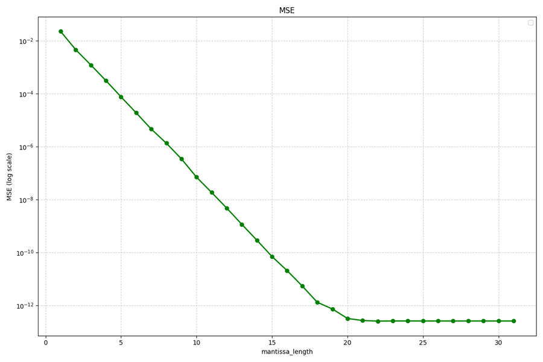

   <small><b>图9.2 HSV颜色空间在定点表示下的结果</b></small>

* **结论：** 浮点的指数长度 4 比特、尾数 8 的情况下，MSE 约达到$10^{-6}$，与定点 8 比特持平。<font color=purple>因此，HSV 采用定点方案实施</font>

2. <big><b>CLAHE 是否还是在 HSV 颜色域使用</b></big>

3. <big><b>饱和度算法使用自然饱和度算法还是线性饱和度算法</b></big>

   前者

4. <big><b>采用双滤波方案还是一个滤波的方案</b></big>

5. <big><b>处理不同位深（8-bit/10-bit）的架构选择与已知挑战</b></big>

   **问题描述：**
   针对PQE模块需要同时支持8-bit和10-bit色深视频流的现实需求，我们面临一个关键的架构决策：

   - **方案一（统一内部处理位宽）：** 将所有输入信号（无论是8-bit还是10-bit）统一转换为10-bit位宽，让核心算法流水线仅处理10-bit数据，最后再根据需要将输出转换回目标位宽。即“8b/10b输入 -> 10b处理 -> 8b/10b输出”的流程。该方案的**优点是能简化设计与验证：** 核心算法只需针对单一数据路径优化，极大降低了设计和验证的复杂度。但是该方案导致8比特色深的**图像质量受损：** 已发现该方案在处理8-bit视频时会引入额外的量化噪声，损害画质。
   - **方案二（算法兼容双位宽）：** 设计能够根据输入信号动态适应的算法模块。这意味着流水线中的**每一个**图像处理单元（如饱和度增强、对比度增强、锐化等）都必须具备同时处理8-bit和10-bit两种数据宽度的能力。与方案一相比，方案二的**缺点设计复杂：** 每个算法模块都需维护两套处理逻辑，设计和验证工作量剧增，出错风险高。
   
   **结论：**
   由于方案一在8-bit色深图像质量上存在明显劣势，最终架构选择为**方案二**。

<div STYLE="page-break-after: always;"></div>

附录
===
附录A 术语表
---

| 术语/缩写 | 英文全称/中文解释                                            |
| --------- | ------------------------------------------------------------ |
| **AHB**   | **Advanced High-performance Bus**。AMBA 规范中的一种总线协议，用于连接处理器、内存和外设。 |
| **CLAHE** | **Contrast Limited Adaptive Histogram Equalization** (对比度受限的自适应直方图均衡)。一种用于增强图像局部对比度的算法。 |
| **CDC**   | **Clock Domain Crossing** (跨时钟域)。指信号在两个不同时钟域之间传递的过程，需要特殊设计以防止亚稳态。 |
| **DE**    | **Data Enable** (数据使能)。视频接口信号，用于指示数据总线上的像素数据是有效的。对应本文档中的 `ide` 和 `ode`。 |
| **HDR**   | **High Dynamic Range** (高动态范围)。一种提升图像亮度和色彩范围的技术，使画面更接近人眼所见的真实世界。 |
| **HS**    | **Horizontal Sync** (行同步)。视频接口信号，标志着一行像素的结束。对应本文档中的 `ihs` 和 `ohs`。 |
| **HSV**   | **Hue, Saturation, Value** (色相, 饱和度, 明度)。一种颜色模型。 |
| **IP**    | **Intellectual Property** (知识产权)。在芯片设计领域，指可复用的、经过验证的设计模块。 |
| **LANE**  | **通道/路**。本文档中指代并行的视频数据传输路径，增加 LANE 数量可以提高传输带宽。 |
| **REGF**  | **Register File** (寄存器文件)。用于控制和监视 PQE 核内部状态的一组硬件寄存器。 |
| **VS**    | **Vertical Sync** (场同步)。视频接口信号，标志着一帧画面的结束。对应本文档中的 `ivs` 和 `ovs`。 |
| **YCoCg** | 一种颜色空间，它将亮度信息（Y）与色度信息（Co，Cg）分离。    |
